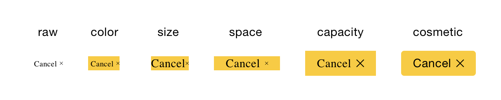
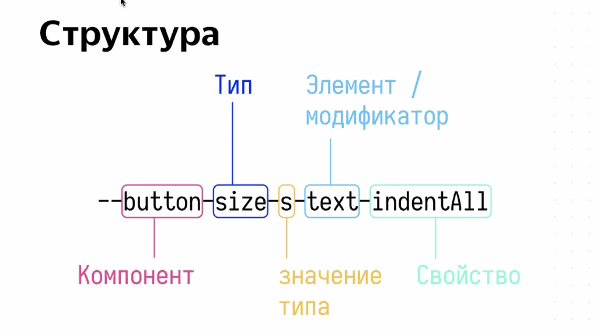

## Как происходит кастомизация?

### 1 шаг

Для того чтобы создать свою Тему, можно воспользоваться стартовой болванкой, скопировав одну из стандартных тем (**theme_color_wtpr-default**, **theme_color_wtpr-brand**, **theme_color_wtpr-inverse**), заменив слово **wtpr** в названии бренда.

### 2 шаг

Уровень кастомизации доступен разный (зависит от потребности проекта). Так как все значения переменных контролов наследуются от базовых значений, для начала следуют установить цветовые значения для них.

`$color-base-base` *— базовый цвет содержимого, от которого выстраиваются цвета текста, иконок, ...*

`$color-base-essential` *— базовый цвет поверхностей;*

`$color-base-project` *— проектный цвет, от которого выстраивают акцентные состояния;*

`$color-base-phantom` *— тонирующий цвет, от которого выстраиваются бордеры, паранджа, ...;*

`$color-base-path` *— ссылочный цвет, от которого выстраиваются все их вариации;*

`$color-base-success` *****— цвет успеха, от которого выстраивается как сататусный фон, так и типографика;*

`$color-base-alert` *— цвет ошибки, от которого выстраивается как статусный фон, так и типографика;*

`$color-base-warning` *— цвет предупреждения, от которого выстраивается как статусный фон, так и типографика;*

`$color-base-normal` *— нейтральный цвет, от которого выстраивается как статусный фон, так и типографика;*

После манипуляций с базовыми цветами можно увидеть как контролы примут новые цвета во всех свои состояния. Часто подобных изменений бывает вполне достаточно и можно считать цветовую Тему готовой к использованию.

### 3 шаг

Если в конце предыдущего есть понимание, что такой настройки не достаточно, можно воспользоваться более детальной настройкой цветов в части состояний. Это смело можно реализовать, перейдя к настройки математики, для этого у любой переменной можно подкрутить Hue, Saturation, Lightnes или Alpha обернув её в цветовую функцию color().

```css
color($color-base-project l(33%) s(20%) l(40%) a(60%))
```

Можно оперировать абсолютно любым значением переменных смысловой палитры цветов. Control Default.



Песочница: [https://codesandbox.io/s/whitepaper-controls-demo-vcvu6](https://codesandbox.io/s/whitepaper-controls-demo-vcvu6)

Документаци: [https://yastatic.net/s3/frontend/lego/storybook/index.html?path=/docsx/lego-components-docs-readme--document](https://yastatic.net/s3/frontend/lego/storybook/index.html?path=/docsx/lego-components-docs-theme--document#%D0%BD%D0%B0-%D1%81%D0%B5%D1%80%D0%B2%D0%B5%D1%80%D0%B5)

