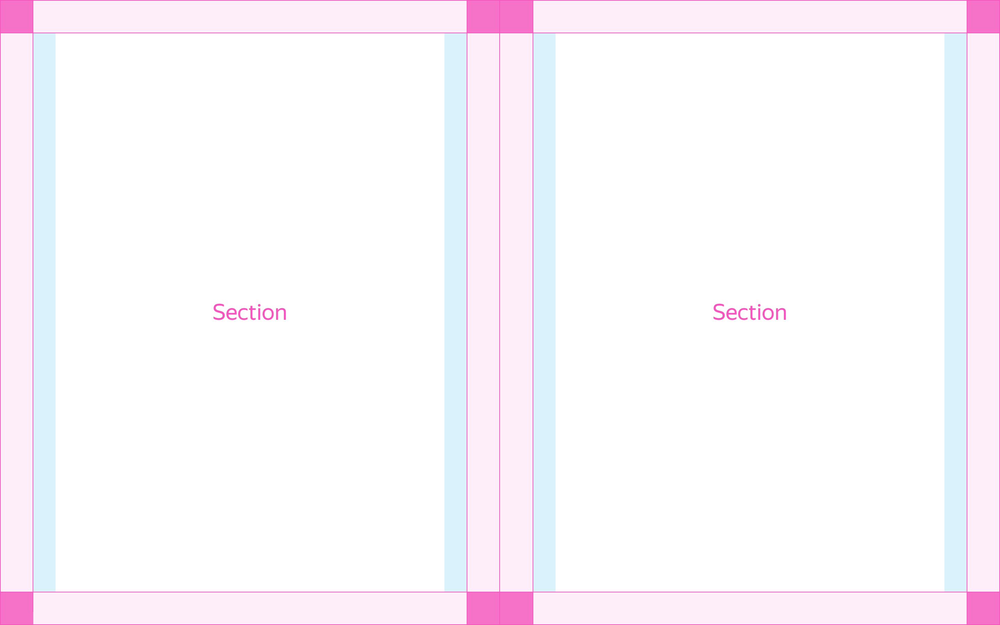
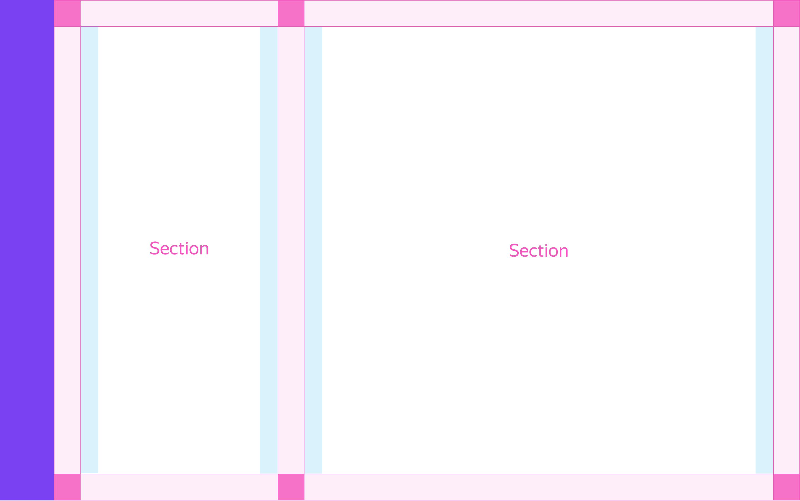

# Лэйаут

Figma: [https://www.figma.com/file/3d3CsJ3OJQDW0dsdtoCEDZ/Templates?node-id=1%3A2](https://www.figma.com/file/3d3CsJ3OJQDW0dsdtoCEDZ/Templates?node-id=1%3A2)

Определяет структуру того, как будет разбита страница/экран по вертикали в процентном соотношении. Для этого нужно задать его модификатору `structure` соответствующее значение. Как правило, это сплитирование экрана с разбивкой на две или три части.



```json
{
  block: 'tpl-layout',
  mods: { structure: '50-50 },
  content: [
    {
      elem: 'section',
      content: [ ... ]
    },
    {
      elem: 'section',
      content: [ ... ]
    }
  ]
}
```

Если на странице должно быть боковое меню, используется значение с префиксом `fold` (свернутое) или `unfold` (развернутое). Размер меню задается в модификаторе темы, который так и называется menu.



```json
{
  block: 'tpl-layout',
  mods: { structure: 'fold-30-70' },
  content: [
    {
      elem: 'section',
      content: [ ... ]
    },
    {
      elem: 'section',
      content: [ ... ]
    },
    {
      elem: 'section',
      content: [ ... ]
    }
  ]
}
```

[Модификаторы](%D0%9B%D1%8D%D0%B8%CC%86%D0%B0%D1%83%D1%82%20aa2864aab8644abeb79ee33949fe457d/%D0%9C%D0%BE%D0%B4%D0%B8%D1%84%D0%B8%D0%BA%D0%B0%D1%82%D0%BE%D1%80%D1%8B%20254d8a1deda644adba31e10b28543e6f.csv)

| Название      | Значения                                                     | Описание                                         |
| ------------- | ------------------------------------------------------------ | ------------------------------------------------ |
| **structure** | `30–70`, `50–50`, `70–30`                                    | Разделение страницы на секции без меню           |
| **structure** | `fold-100`, `fold-30–70`, `fold-50–50`, `fold-70–30`         | Разделение страницы на секции со свёрнутым меню  |
| **structure** | `unfold-100`, `unfold-30–70`, `unfold-50–50`, `unfold-70–30` | Разделение страницы на секции с развёрнутым меню |

[Элементы](%D0%9B%D1%8D%D0%B8%CC%86%D0%B0%D1%83%D1%82%20aa2864aab8644abeb79ee33949fe457d/%D0%AD%D0%BB%D0%B5%D0%BC%D0%B5%D0%BD%D1%82%D1%8B%20f66330ff64aa47329e317c8bd025866f.csv)

| Элемент | Описание |
|----------|-----------|
| **section** | Разделитель страницы, работает по правилам, заданным значением модификатора `structure` |

Сплитовые конструкции чаще всего используются для многошаговых процессов или авторизации. Одна из частей является функциональной. В неё как правило размещается форма или другие интерактивные компоненты, с которыми взаимодействует человек.

Вторая часть конструкции, как правило, является дополнитель и используются создания атфомсферы или для размещения вспомогательной информации, в то время как вертикальная разбивка с меню чаще всего применяется для формирования основного лэйаута в сервисных продуктах, где секции являются независимыми поверхностями и сеет свой собственный скролл.