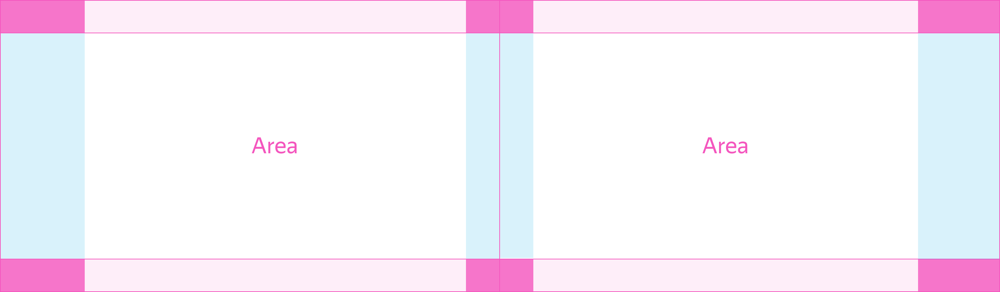
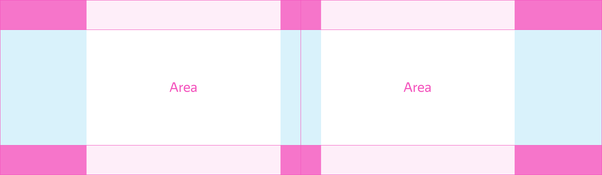
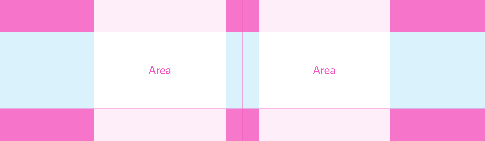
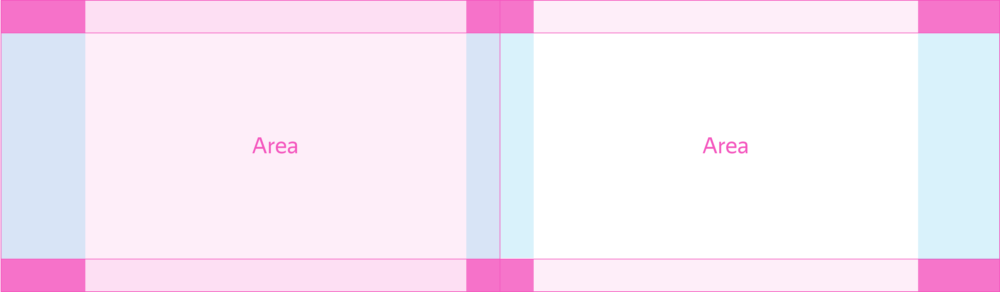
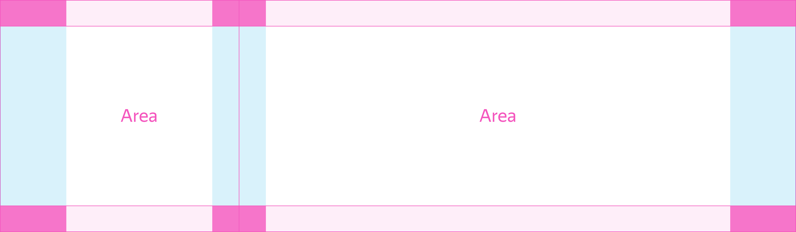

# Секция

Figma: [https://www.figma.com/file/3d3CsJ3OJQDW0dsdtoCEDZ/Templates?node-id=1%3A254](https://www.figma.com/file/3d3CsJ3OJQDW0dsdtoCEDZ/Templates?node-id=1%3A254)

Является базой для разбивки всей контентной части страницы. Секция может использоваться как один раз, так и многократно в рамках одного экрана, при этом содержать одну или две области для наполнения содержимым. Если области две, то c помощь модификатора `structure` происходит управление их пропорциональным соотношение внутри.

Модификатор `space-vertical` позволяет управлять вертикальным отступом, горизонтальные же отступы вычисляются динамически, в зависимости от размера экрана и ширины контейнера.

[Модификаторы](%D0%A1%D0%B5%D0%BA%D1%86%D0%B8%D1%8F%20a97e92205fc749fcad4fdc3d997025a5/%D0%9C%D0%BE%D0%B4%D0%B8%D1%84%D0%B8%D0%BA%D0%B0%D1%82%D0%BE%D1%80%D1%8B%2082a066e5cba348649829f73c3010387d.csv)



```json
{
  block: 'tpl-section',
  mods: { structure: '50-50', size: 'l', 'space-v': 'half' },
  content: [
    {
      elem: 'area',
      content: {
        elem: 'container',
        content: [ ... ]
      }
    },
    {
      elem: 'area',
      elemMods: { view: 'ghost' },
      content: {
        elem: 'container',
        content: [ ... ]
      }
    }
  ]
}
```



```json
{
  block: 'tpl-section',
  mods: { structure: '50-50', size: 'm', 'space-v': 'half' },
  content: [
    {
      elem: 'area',
      content: {
        elem: 'container',
        content: [ ... ]
      }
    },
    {
      elem: 'area',
      elemMods: { view: 'ghost' },
      content: {
        elem: 'container',
        content: [ ... ]
      }
    }
  ]
}
```



```json
{
  block: 'tpl-section',
  mods: { structure: '50-50', size: 's', 'space-v': 'half' },
  content: [
    {
      elem: 'area',
      content: {
        elem: 'container',
        content: [ ... ]
      }
    },
    {
      elem: 'area',
      elemMods: { view: 'ghost' },
      content: {
        elem: 'container',
        content: [ ... ]
      }
    }
  ]
}
```

### Элемент area

Элемент `area` задаёт безопасные отступы по бокам, чтобы контент не прилипал к краям экрана. Размер отступов переопределяется в зависимости от ширины экрана.

[Модификаторы ](%D0%A1%D0%B5%D0%BA%D1%86%D0%B8%D1%8F%20a97e92205fc749fcad4fdc3d997025a5/%D0%9C%D0%BE%D0%B4%D0%B8%D1%84%D0%B8%D0%BA%D0%B0%D1%82%D0%BE%D1%80%D1%8B%204061025cf1f444b59a4d0b6d561301de.csv)

| Название           | Значения                                           | Описание                        |
| ------------------ | -------------------------------------------------- | ------------------------------- |
| **structure**      | `50–50`, `60–40`, `40–60`, `30–70`, `70–30`, `100` | Пропорция контентных областей   |
| **size**           | `xs`, `s`, `m`, `l`                                | Размер контейнера               |
| **space-vertical** | `3x`, `2x`, `full`, `two-thirds`, `half`, `third`  | Внутренние вертикальные отступы |



```json
 {
  block: 'tpl-section',
  mods: { structure: '50-50', size: 'l', 'space-v': 'half' },
  content: [
    {
      elem: 'area',
      elemMods: { view: 'ghost' },
      content: {
        elem: 'container',
        content: [ ... ]
      }
    },
    {
      elem: 'area',
      elemMods: { view: 'ghost' },
      content: {
        elem: 'container',
        content: [ ... ]
      }
    }
  ]
}
```

В большинстве случаев нам нужно ограничить ширину контента, для этого используется элемент container, который располагается по центру экрана. Он принимает нужную ширину в зависимости от модификатора `size` у родителя. Пропорциональная разбивка производится с учётом контейнернной ширины. Остальная же часть пространства от границы контейнера до краёв экрана в равной пропорции, расходуется на внутренние боковые отступы по краям экрана.



```json
{
  block: 'tpl-section',
  mods: { structure: '30-70', size: 'm', 'space-v': 'half' },
  content: [
    {
      elem: 'area',
      elemMods: { view: 'ghost' },
      content: {
        elem: 'container',
        content: [ ... ]
      }
    },
    {
      elem: 'area',
      elemMods: { view: 'ghost' },
      content: {
        elem: 'container',
        content: [ ... ]
      }
    }
  ]
}
```

Если ширина экрана меньше ширины контейнера, то он сжимается под ширину экрана минус безопасные отступы по бокам.