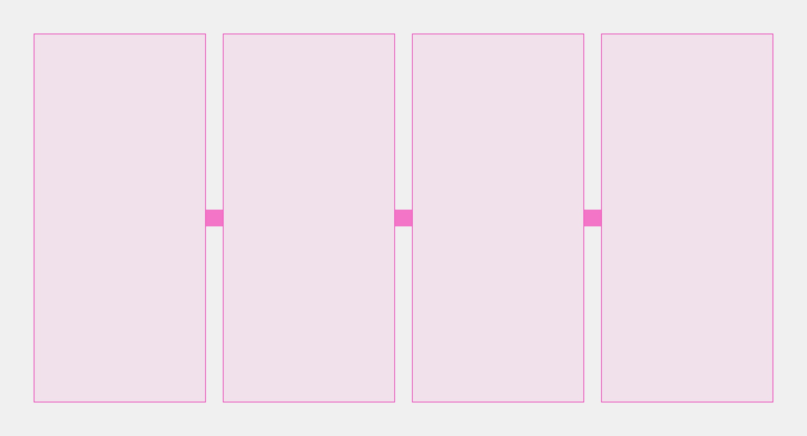
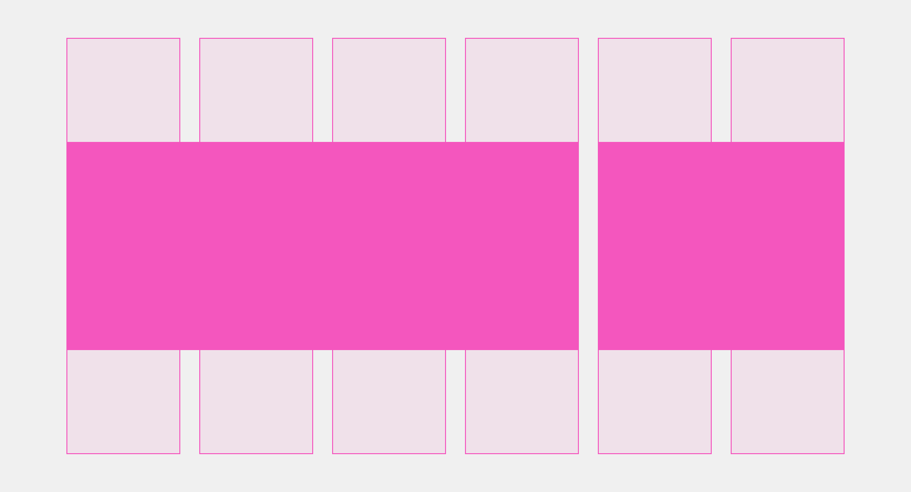
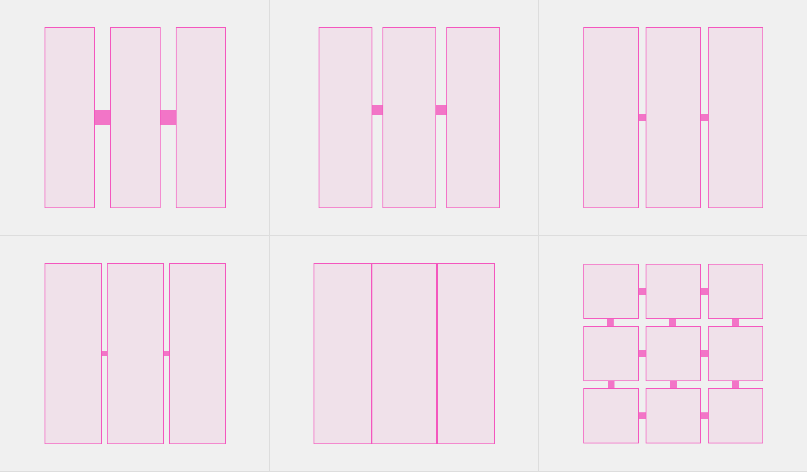

# Сетка

Figma: [https://www.figma.com/file/3d3CsJ3OJQDW0dsdtoCEDZ/Templates?node-id=1%3A546](https://www.figma.com/file/3d3CsJ3OJQDW0dsdtoCEDZ/Templates?node-id=1%3A546)

Сетка отвечает за выравнивание и разбивку содержимого внутри контентной части. Есть два варианта использования сетки.

### Пропорциональная сетка

Этот тип сетки следует использовать для того, чтобы разбить контентное содержимое в секции на равные части.

Достаточно указать только количество секций в строке и расстояние между колонками. Все прямые «дети» такой секции сами подстроятся по указанным правилам.

Для каждого брейкпоинта можно указывать своё значение модификатора `ratio`, но это не обязательно.

Помните, что все адаптивные правила перестроения и изменения свойств наследуются от меньшего брейкпоинта к большему.

Переменные брейкпоинтов хранятся в модификаторе темы breakpoint и соответствуют префиксам в сетках.



```json
{
  block: 'tpl-grid',
  mods: { 's-ratio': '1-1', 'm-ratio': '1-1-1', 'l-ratio': '1-1-1-1', 'col-gap': 'third', 'row-gap': 'third' }
  content: [
    {
      elem: 'fraction',
      content: [...]
    },
    {
      elem: 'fraction',
      content: [...]
    },
    {
      elem: 'fraction',
      content: [...]
    },
    {
      elem: 'fraction',
      content: [...]
    }
  ]
}
```

[Модификаторы](%D0%A1%D0%B5%D1%82%D0%BA%D0%B0%202dcab6b9329d4a02b7e294671769acce/%D0%9C%D0%BE%D0%B4%D0%B8%D1%84%D0%B8%D0%BA%D0%B0%D1%82%D0%BE%D1%80%D1%8B%20b99b13beb71842c0b3d307777168be62.csv)


| Название | Значения                                        | Описание |
| -------- | ----------------------------------------------- | -------- |
| xs-ratio | 1-1 / 1-1-1                                     |          |
| s-ratio  | 1-1 / 1-1-1 / 1-1-1-1 / 1-1-1-1-1 / 1-1-1-1-1-1 |          |
| m-ratio  | 1-1 / 1-1-1 / 1-1-1-1 / 1-1-1-1-1 / 1-1-1-1-1-1 |          |
| l-ratio  | 1-1 / 1-1-1 / 1-1-1-1 / 1-1-1-1-1 / 1-1-1-1-1-1 |          |
| xl-ratio | 1-1 / 1-1-1 / 1-1-1-1 / 1-1-1-1-1 / 1-1-1-1-1-1 |          |
|          |                                                 |          |

### Колоночная сетка

Этот тип сетки следует использовать для того, чтобы разбить контентное содержимое на части имеющих разную пропорцию. Чтобы описать колоночную сетку нужно указать допустимое количество `columns` , а в значениях каждому элементу `fraction` нужно указать сколько колонок он займёт. Колоночная сетка хорошо подходит, если внутренние блоки разной ширины или высоты.

Как и с `ratio`, для каждого брейкпоинта при необходимости можно указывать свой модификатор `columns`.

В колоночной сетке элементы `fraction` имеют модификаторы на ширину в колонках `col` и опциональный на высоту в строках `row`.

[Модификаторы](%D0%A1%D0%B5%D1%82%D0%BA%D0%B0%202dcab6b9329d4a02b7e294671769acce/%D0%9C%D0%BE%D0%B4%D0%B8%D1%84%D0%B8%D0%BA%D0%B0%D1%82%D0%BE%D1%80%D1%8B%2062c7d7545d8a4e6091b07648880e1c69.csv)

| Название       | Значения        | Описание                                   |
| -------------- | --------------- | ------------------------------------------ |
| **xs-columns** | `2`, `3`        | Количество возможных колонок при ширине XS |
| **s-columns**  | `5`, `6`, `8`   | Количество возможных колонок при ширине S  |
| **m-columns**  | `6`, `10`, `12` | Количество возможных колонок при ширине M  |
| **l-columns**  | `6`, `10`, `12` | Количество возможных колонок при ширине L  |
| **xl-columns** | `6`, `10`, `12` | Количество возможных колонок при ширине XL |

### Элемент fraction

Дополнительно для каждого `fraction` указывается количество колонок, которое он может может занимать при разных разрешениях экрана. Таким образом, мы получаем большую гибкость и все необходимые выразительные средства для динамического изменения композиции. Если на каком-либо разрешении не нужно делать перестроение, то указывать модификатор нет никакой необходимости, применится правило указанное для меньшего размера.

В колоночной сетке элементы `fraction` имеют модификаторы на ширину в колонках `col` и опциональный на высоту в строках `row`. 

[Модификатор](%D0%A1%D0%B5%D1%82%D0%BA%D0%B0%202dcab6b9329d4a02b7e294671769acce/%D0%9C%D0%BE%D0%B4%D0%B8%D1%84%D0%B8%D0%BA%D0%B0%D1%82%D0%BE%D1%80%2068be394f4f5149aa82cecc230d54f452.csv)

| Модификатор | Значения | Описание |
|--------------|-----------|-----------|
| **xs-col** | `1`, `2`, `3` | Ширина элемента в колонках при ширине экрана XS |
| **s-col** | `1`, `2`, `3`, `4`, `5`, `6`, `7`, `8`, `9` | Ширина элемента в колонках при ширине экрана S |
| **m-col** | `1`, `2`, `3`, `4`, `5`, `6`, `7`, `8`, `9` | Ширина элемента в колонках при ширине экрана M |
| **l-col** | `1`, `2`, `3`, `4`, `5`, `6`, `7`, `8`, `9` | Ширина элемента в колонках при ширине экрана L |
| **xl-col** | `1`, `2`, `3`, `4`, `5`, `6`, `7`, `8`, `9` | Ширина элемента в колонках при ширине экрана XL |

Говоря про сетки, подразумевается возможность оперировать пропорцией фракций сразу по двум осям, соответственно можно указать какое количесство строк займёт `fraction` на разных разрешениях (в примере это видно у первого элемента, модификатор `l-row: 2` позволяет ему занимать две колонки на большом разрешении экрана).

[Модификатор](%D0%A1%D0%B5%D1%82%D0%BA%D0%B0%202dcab6b9329d4a02b7e294671769acce/%D0%9C%D0%BE%D0%B4%D0%B8%D1%84%D0%B8%D0%BA%D0%B0%D1%82%D0%BE%D1%80%2039c19905d3104190aee66ae9307ff7b7.csv)

| Модификатор | Значения | Описание |
|--------------|-----------|-----------|
| **xs-row** | `1`, `2`, `3` | Высота элемента в строках при ширине экрана XS |
| **s-row** | `1`, `2`, `3` | Высота элемента в строках при ширине экрана S |
| **m-row** | `1`, `2`, `3` | Высота элемента в строках при ширине экрана M |
| **l-row** | `1`, `2`, `3` | Высота элемента в строках при ширине экрана L |
| **xl-row** | `1`, `2`, `3` | Высота элемента в строках при ширине экрана XL |


```json
{
  block: 'tpl-grid',
  mods: { 's-columns': '6', 'm-columns': '10', 'l-columns': '12', 'col-gap': 'third', 'row-gap': 'third' },
  content: [
    {
      elem: 'fraction'
      elemMods: { 's-col': '3', 'm-col': '6', 'l-col': '8' }
    },
    {
      elem: 'fraction',
      elemMods: { 's-col': '3', 'm-col': '4' }
    },
    {
      elem: 'fraction',
      elemMods: { 's-col': '3', 'm-col': '4' }
    },
    {
      elem: 'fraction'
      elemMods: { 's-col': '3', 'm-col': '6', 'l-col': '8' }
    }
  ]
}
```

### Отступы

Для управления отступами применяются модификаторы на расстояние между
колонками и между строками, в них используются переменные с префиксом `col-gap`, `row-gap`, которые находятся в теме, где их можно при необходимости
переопределить. Перед началом использования сеток следует прочитать
про отступы в теме.

[Модификаторы](%D0%A1%D0%B5%D1%82%D0%BA%D0%B0%202dcab6b9329d4a02b7e294671769acce/%D0%9C%D0%BE%D0%B4%D0%B8%D1%84%D0%B8%D0%BA%D0%B0%D1%82%D0%BE%D1%80%D1%8B%2055711808a8b545f5b69be91a2608052d.csv)

| Модификатор | Значения | Описание |
|--------------|-----------|-----------|
| **col-gap** | `full`, `two-thirds`, `half`, `third` | Отступ между колонками: полный / две трети / половина / треть |
| **row-gap** | `full`, `two-thirds`, `half`, `third` | Отступ между строками: полный / две трети / половина / треть |


