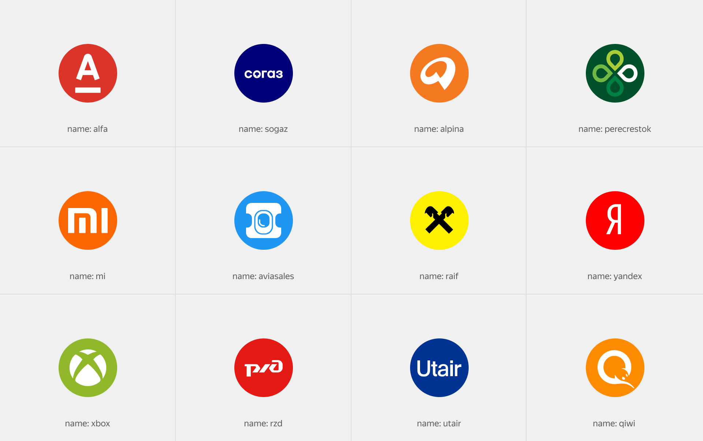

# Логотип

Figma: [https://www.figma.com/file/bEm9RDSMMKidd1epwXlRAW/Content?node-id=1%3A18698](https://www.figma.com/file/bEm9RDSMMKidd1epwXlRAW/Content?node-id=1%3A18698)

Служит для отображения логотипов брендов. Может использоваться как самостоятельный блок, так и как часть какой-либо смысловой сущности. Например истории или в блоках скидочных предложений. В библиотеке логотипы есть практически для всех партнёров и продолжат постоянно пополняться.



```json
{
  block: 'logo',
  mods: { name: 'yandex', size: 'm' }
}
```

[Модификаторы](%D0%9B%D0%BE%D0%B3%D0%BE%D1%82%D0%B8%D0%BF%20a07c6169154d47dca82b529dd27119eb/%D0%9C%D0%BE%D0%B4%D0%B8%D1%84%D0%B8%D0%BA%D0%B0%D1%82%D0%BE%D1%80%D1%8B%20788c397e91694cfa83bb07f383ac06cf.csv)

| Название | Значения | Описание |
|-----------|-----------|-----------|
| **name** | `absolute`, `acado`, `accion`, ... | Название изображения |
| **size** | `s`, `m`, `l`, `xl` | Размер изображения |
