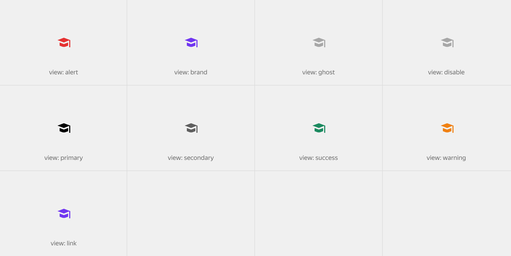

# Пикторграмма

Figma: [https://www.figma.com/file/bEm9RDSMMKidd1epwXlRAW/Content?node-id=1%3A2550](https://www.figma.com/file/bEm9RDSMMKidd1epwXlRAW/Content?node-id=1%3A2550)

Наряду с текстом практически любой ёмкий смысл можно выразить или усилить с помощью изобразительной метафоры. Пиктограммы можно встретить в совершенно различных частях интерфейса, она может быть как самостоятельной сущность, так и находиться внутри контрола, но чаще всего она используется рядом с текстовым блоком.

В зависимости от массы окружающего контента используется нужный размерный модификатор.


![[2. Спецификации по продуктовой разработке/Дизайн продукта/Контент/Пикторграмма/Size.png]]

Для визуального комбинирования с типографикой и пикторграммы предусмотрены аналогичные такие же цветовые модификации как и у текстового блока.



```json
{
  block: 'pictogram',
  mods: { name: 'hat', view: 'primary', size: 'm' }
}
```

Модификатор на наличие круга позволяет повысить массу пиктограммы и увеличить её якорность.


```json
{
  block: 'pictogram',
  mods: { name: 'hat', round: 'success', size: 'm' }
}
```

[Модификаторы](%D0%9F%D0%B8%D0%BA%D1%82%D0%BE%D1%80%D0%B3%D1%80%D0%B0%D0%BC%D0%BC%D0%B0%2073fd783629e94117a2bacca28258094c/%D0%9C%D0%BE%D0%B4%D0%B8%D1%84%D0%B8%D0%BA%D0%B0%D1%82%D0%BE%D1%80%D1%8B%20857749a06ffe4dbf954f120c1a41c978.csv)

| Название | Значения | Описание |
|-----------|-----------|-----------|
| **name** | `account`, `download`, ... | Название изображения |
| **size** | `s`, `m` | Размер иконки |
| **view** | `alert`, `brand`, `disable`, `ghost` | Цвет отображения иконки |
| **round** | `alert`, `success`, `system`, `warning` | Цвет круглого фона |
