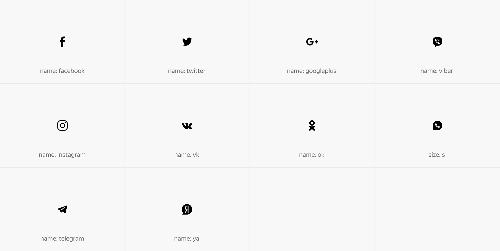
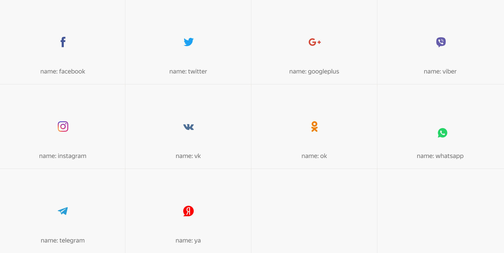
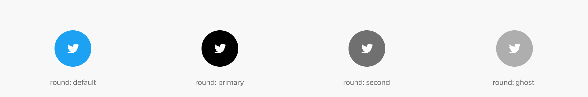

# Сети

Figma: [https://www.figma.com/file/bEm9RDSMMKidd1epwXlRAW/Content?node-id=19%3A171](https://www.figma.com/file/bEm9RDSMMKidd1epwXlRAW/Content?node-id=19%3A171)

Монохромное (с цветовым значением заданным в Теме);



```json
{
  block: 'social',
  mods: { name: 'twitter', view: 'primary', size: 'm' }
}
```

По-умолчанию (c соответствующим цветовым оформлением).



```json
{
  block: 'social',
  mods: { name: 'twitter', view: 'default', size: 'm' }
}
```

Модификатор на наличие круга позволяет повысить массу знака и увеличить её якорность.



```json
{
  block: 'social',
  mods: { name: 'twitter', round: 'primary', size: 'm' }
}
```

[Модификаторы](%D0%A1%D0%B5%D1%82%D0%B8%203b1d8abb53d247378849a1f28602c68b/%D0%9C%D0%BE%D0%B4%D0%B8%D1%84%D0%B8%D0%BA%D0%B0%D1%82%D0%BE%D1%80%D1%8B%20a38aafab0f464d81af6d49e54ea0cfec.csv)

| Название | Значения | Описание |
|-----------|-----------|-----------|
| **name** | `facebook`, `twitter` | Название изображения |
| **size** | `m` | Размер иконки |
| **view** | `ghost`, `primary`, `secondary`, `default` | Цвет отображения иконки |
| **round** | `default`, `alert`, `success`, `normal` | Цвет круглого фона |
