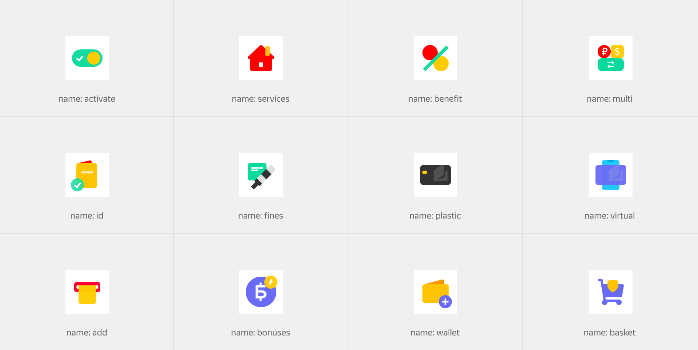

# Стикер

Figma: [https://www.figma.com/file/bEm9RDSMMKidd1epwXlRAW/Content?node-id=1%3A298](https://www.figma.com/file/bEm9RDSMMKidd1epwXlRAW/Content?node-id=1%3A298)

Служит для отображения крупных графических элементов более сложной структуры, чем пиктограммы. Блок является декоративным и дополнительно поддерживает смысловой контент. Его можно встретить в промо секциях в роли якорного элемента или внутри коммуникационных вставок в рамках сервиса для отображения маркетинговой информации. Блок имеет ряд размерных модификаций, что позволяет органично использовать с разным контентом.



```json
{
  block: 'sticker',
  mods: { name: 'plastic', size: 'm' }
}
```

[Модификаторы блока](%D0%A1%D1%82%D0%B8%D0%BA%D0%B5%D1%80%20f0e13c7123c24661b3d0c687dbb269b2/%D0%9C%D0%BE%D0%B4%D0%B8%D1%84%D0%B8%D0%BA%D0%B0%D1%82%D0%BE%D1%80%D1%8B%20%D0%B1%D0%BB%D0%BE%D0%BA%D0%B0%2006f260fa9dd149f68f2d3d08d39bab91.csv)

| Название | Значения | Описание |
|-----------|-----------|-----------|
| **name** | `bonuses`, `id`, `plastic`, ... | Имя |
| **size** | `s`, `m`, `l` | Размер |
