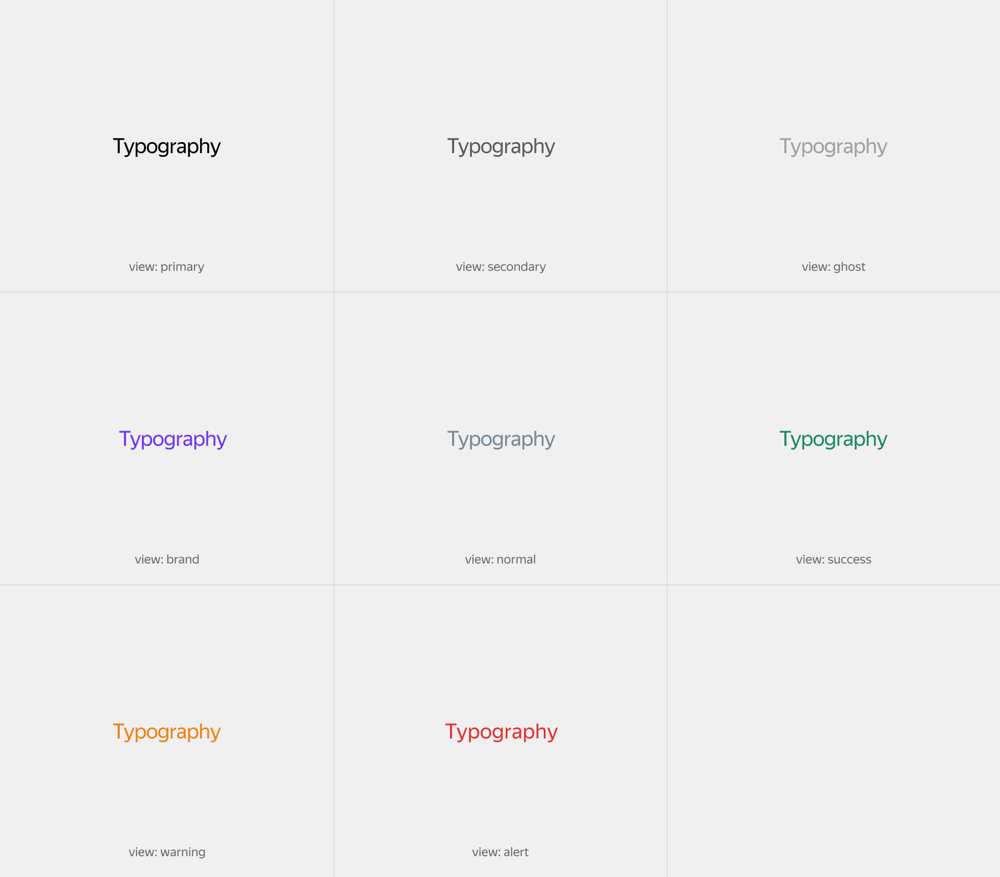

# Текст

Figma: [https://www.figma.com/file/bEm9RDSMMKidd1epwXlRAW/Content?node-id=39%3A0](https://www.figma.com/file/bEm9RDSMMKidd1epwXlRAW/Content?node-id=39%3A0)

В основе любого интерфейса лежит типографика. В вебе у текстовых блоков есть много разных свойств влияющих на отображение. Поэтому для более легкого управления внешним видом текста существует одноимённый блок text с модификаторами на цвет, размер, жирность, регистр и еще несколько дополнительных. Используя их в различных комбинациях, можно получить любое необходимое отображение.

В интерфейсе **text** встречается двух типов:

Первый вариант используется внутри смысловых интерфейсных блоков. Например лейбл поля формы или комментарий под публикацией, в таких случаях текстовый блок в нужной модификации кладётся внутрь элемента смысловой сущности. Такой подход к типографики даёт всю нужную выразительность в конкретном контексте, при этом поддерживается общая продуктовая консистентность.

Размерные модификаторы блока как правило используются для формирования информационной иерархии с помощью модификатора size.
![[2. Спецификации по продуктовой разработке/Дизайн продукта/Контент/Текст/Size.png]]


```json
{
  block: 'text',
  mods: { size: 'm' },
  content: 'Typography'
}
```

Для подчёркивания статусности и первичности (или второстепенности) информации используется модификатор view с соответствующими значениями.



```json
{
  block: 'text',
  mods: { view: 'primary' },
  content: 'Typography'
}
```

Регистр используется для увеличения массы, обычно применяется для подзаголовков третьего и четвёртого уровня при совпадении их размера с базовым текстом для усиления контраста. За верхний регистр в текстовом блоке отвечает модификатор transform в значении uppercase.


```json
{
  block: 'text',
  mods: { transform: 'uppercase' },
  content: 'Typography'
}
```

Межбуквенный увеличивается, при наличии у текста верхнего регистра. Он выставляется с помощью модификатора spacing и его значение увеличивается прямо пропорционально значению модификатора size.


```json
{
  block: 'text',
  mods: { spacing: 'm' }
}
```

Модификатор на стиль используется для выделения определённого текстового фрагмента в общем потоке. Такой приём хорошо подходит для обращения внимания на ключевую мысль.


```json
{
  block: 'text',
  mods: { style: 'italic' },
  content: 'Typography'
}
```

Также увеличить выразительность или контраст текста можно с помощью жирности, добавив модификатор weight в нужном значении.


```json
{
  block: 'text',
  mods: { weight: 'bold' },
  content: 'Typography'
}
```

Второй вариант использования текста на информационных страницах в качестве самостоятельной интерфейсной единицы. Для этого к блоку text добавляется еще один модификатор — type со определённым значением с учётом семантики, для него прописаны относительные отступы, которые высчитываются с учётом заложенных типографических рекомендаций. Это помогает легче считывать информацию.


```json
{
  block: 'text',
  mods: { type: 'h2' },
  content: 'Typography'
}
```

[Модификаторы](%D0%A2%D0%B5%D0%BA%D1%81%D1%82%20b4b6f7df4f254c28b7ff7d5d9bddbb10/%D0%9C%D0%BE%D0%B4%D0%B8%D1%84%D0%B8%D0%BA%D0%B0%D1%82%D0%BE%D1%80%D1%8B%2001b6b3f334d4405690024d57ecc72503.csv)

| Название      | Значения                                              | Описание                 |
| ------------- | ----------------------------------------------------- | ------------------------ |
| **size**      | `xs`, `s`, `m`, `l`, `xl`, `2xl`, `3xl`, `4xl`, `5xl` | Размер                   |
| **view**      | `brand`, `ghost`, `link`, `primary`, `secondary`      | Вид отображения          |
| **weight**    | `bold`, `light`, `regular`, `semibold`                | Жирность                 |
| **transform** | `originalcase`, `uppercase`, `lowercase`              | Вид трансформации        |
| **spacing**   | `xs`, `s`, `m`                                        | Расстояние между буквами |
| **style**     | `regular`, `italic`                                   | Стиль шрифта             |
| **type**      | `blockquote`, `h1`, `h2`, `h3`, `p`                   | Тип                      |