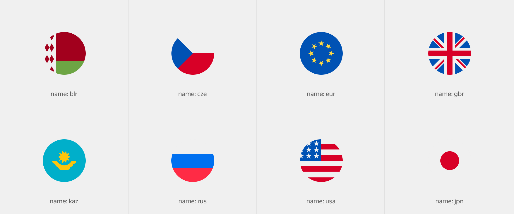

# Флаг

Figma: [https://www.figma.com/file/bEm9RDSMMKidd1epwXlRAW/Content?node-id=1%3A18698](https://www.figma.com/file/bEm9RDSMMKidd1epwXlRAW/Content?node-id=1%3A18698)

Служит для отображения флагов различных стран. Используется, когда нужно сделать не просто шильдик, а более явный маркер для обозначения принадлежности информации к какой-либо стране. Это может быть географическая позиция, часовой пояс, язык или валютный счёт.



```json
{
  block: 'flag',
  mods: { name: 'rus', size: 'm' }
}
```

[Модификаторы](%D0%A4%D0%BB%D0%B0%D0%B3%2092342318912a44ccba6d3d556b56d4d1/%D0%9C%D0%BE%D0%B4%D0%B8%D1%84%D0%B8%D0%BA%D0%B0%D1%82%D0%BE%D1%80%D1%8B%204401df4e5b9f4cd8a009d10ccf304939.csv)

| Название | Значения | Описание |
|-----------|-----------|-----------|
| **name** | `blr`, `chn`, `eur`, `gbr`, `kaz`, `rus`, `usa` | Имя флага |
| **size** | `s`, `m`, `l` | Размер |