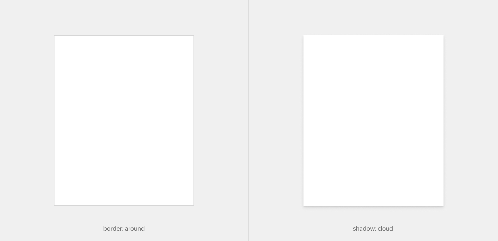

# Карточка

Figma: [https://www.figma.com/file/7kl4eBgLcnK6OYgM01XVig/Patterns?node-id=1%3A788](https://www.figma.com/file/7kl4eBgLcnK6OYgM01XVig/Patterns?node-id=1%3A788)

Предназначен для отображения информации в компактном формате. По своей структуре имеет три ключевых элемента: `header`, `content` и `footer`.

У смыслового блока к которому применяется карточка обязательно должна указываться высота. Элементы `header` и `footer` имеют абсолютное позиционирование и прибиваются к верхней и нижней части блока над остальным контентом.

У каждого из элементов карточки на первом уровне вложенности есть модификаторы на внутренние отступы и модификации на расположение контента внутри.

Их можно увеличивать в зависимости от того, куда встраивается карточка и какое наполнение она имеет.



[Модификатор](%D0%9A%D0%B0%D1%80%D1%82%D0%BE%D1%87%D0%BA%D0%B0%20a75a6b850aad42fa9cc6666e69023044/%D0%9C%D0%BE%D0%B4%D0%B8%D1%84%D0%B8%D0%BA%D0%B0%D1%82%D0%BE%D1%80%208466f6d8169e4a0ea21b236af78f121f.csv)

| Название | Значения | Описание |
|-----------|-----------|-----------|
| **border** | `around` | Выделение границ карточки |
| **shadow** | `cloud` | Тень карточки |


```json
{
  block: 'card',
  mods: { view: 'default' },
  content: [
    {
      elem: 'content',
      elemMods: { 
        'space-v': 'xl', 
        'distribute': 'center', 
        'vertical-align': 'center' 
      },
      content: [ ... ]
    }
  ]
}
```

## Элемент content

Основной дочерний элемент паттерна `card` в котором лежит весь контент.

[Модификаторы](%D0%9A%D0%B0%D1%80%D1%82%D0%BE%D1%87%D0%BA%D0%B0%20a75a6b850aad42fa9cc6666e69023044/%D0%9C%D0%BE%D0%B4%D0%B8%D1%84%D0%B8%D0%BA%D0%B0%D1%82%D0%BE%D1%80%D1%8B%20058dc84891a14a4a81007ffc14f28e53.csv)

| Название | Значения | Описание |
|-----------|-----------|-----------|
| **distribute** | `between`, `center`, `right`, `default` | Распределение элементов по горизонтали |
| **vertical-align** | `baseline`, `bottom`, `center`, `top` | Вертикальное выравнивание в футере |
| **space-around** | `xs`, `s`, `m`, `l`, `xl` | Внутренние отступы вокруг элемента |


```json
{
  block: 'card',
  mods: { view: 'default' },
  content: [
    {
      elem: 'header',
      content: [ ... ]
    },
    {
      elem: 'footer',
      content: [ ... ]
    }
  ]
}
```

## Элемент header

Элемент с абсолютным позиционированием в верхней части родительского блока над остальным контентом. Рекомендуется для использования в роли шапки карточки или элемента `content`.

[Модификаторы](%D0%9A%D0%B0%D1%80%D1%82%D0%BE%D1%87%D0%BA%D0%B0%20a75a6b850aad42fa9cc6666e69023044/%D0%9C%D0%BE%D0%B4%D0%B8%D1%84%D0%B8%D0%BA%D0%B0%D1%82%D0%BE%D1%80%D1%8B%201be942722c7e4e8e8125ef246cfba41c.csv)

| Название | Значения | Описание |
|-----------|-----------|-----------|
| **distribute** | `default`, `between`, `center`, `right` | Распределение элементов по горизонтали |
| **space-around** | `xs`, `s`, `m`, `l`, `xl` | Внутренние отступы вокруг элемента |

## Элемент footer

Элемент с абсолютным позиционированием в нижней части родителя над остальным контентом. Рекомендуется для использования в роли подвала карточки или элемента `content`.

[Модификаторы](%D0%9A%D0%B0%D1%80%D1%82%D0%BE%D1%87%D0%BA%D0%B0%20a75a6b850aad42fa9cc6666e69023044/%D0%9C%D0%BE%D0%B4%D0%B8%D1%84%D0%B8%D0%BA%D0%B0%D1%82%D0%BE%D1%80%D1%8B%204f64593601464cb49c12f43e4d30691c.csv)

| Название           | Значения                                | Описание                               |
| ------------------ | --------------------------------------- | -------------------------------------- |
| **distribute**     | `between`, `center`, `right`, `default` | Распределение элементов по горизонтали |
| **vertical-align** | `baseline`, `center`, `top`, `bottom`   | Вертикальное выравнивание в футере     |
| **space-around**   | `xs`, `s`, `m`, `l`, `xl`               | Внутренние отступы вокруг элемента     |