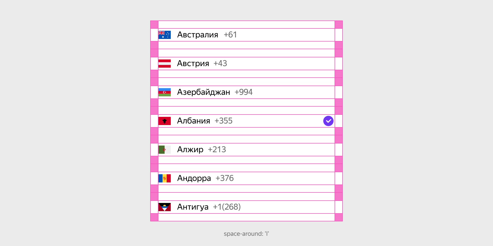
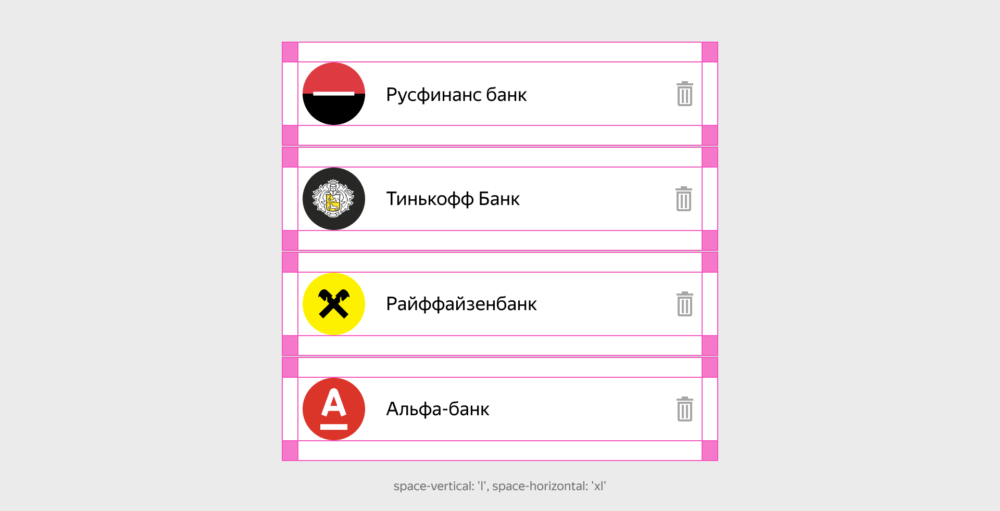

# Список

Figma: [https://www.figma.com/file/7kl4eBgLcnK6OYgM01XVig/Patterns?node-id=1%3A473](https://www.figma.com/file/7kl4eBgLcnK6OYgM01XVig/Patterns?node-id=1%3A473)

Паттерн предназначен для вертикального отображения повторяющихся сущностей. У него есть модификаторы на отступы, бордеры и расположение блоков внутри пунктов списка.



```json
{
  block: 'list',
  mods: { 'space-around': 'l' },
  content: [
    {
      elem: 'item',
      content: [ ... ]
    }
  ]
}
```

Значение модификаторов на внутренние отступы пунктов списка следует увеличивать при увеличении количества или размеров содержимого внутри пунктов.



```json
{
  block: 'list',
  mods: { 'space-vertical': 'xl', 'space-horizontal': 'l' },
  content: [
    {
      elem: 'item',
      content: [
        ...
      ]
    }
  ]
}
```

[Модификации](%D0%A1%D0%BF%D0%B8%D1%81%D0%BE%D0%BA%206f6f68836e9f47ae87a0525f5fd7d007/%D0%9C%D0%BE%D0%B4%D0%B8%D1%84%D0%B8%D0%BA%D0%B0%D1%86%D0%B8%D0%B8%20c78aab118aa94944a205c877d6f2fa15.csv)

| Название | Значения | Описание |
|-----------|-----------|-----------|
| **border** | `between` | Устанавливает границу между элементами |
| **distribute** | `default`, `between` | Распределяет контент внутри элементов |
| **vertical-align** | `baseline`, `center`, `top` | Распределяет контент внутри элементов по вертикали |
| **space-around** | `xs`, `s`, `m`, `l`, `xl` | Внутренние отступы со всех сторон |
| **space-horizontal** | `xs`, `s`, `m`, `l`, `xl` | Внутренние отступы по горизонтали |
| **space-vertical** | `xs`, `s`, `m`, `l`, `xl` | Внутренние отступы по вертикали |
| **indent-vertical** | `xs`, `s`, `m`, `l`, `xl` | Внешний отступ между элементами |
| **stripe** | `even`, `odd` | Зебрирование строк списка |

## Элементы

### Элемент item

Единственный элемент Паттерна, который определяет строку списка. Он служит контейнером для дочернего контента. Внутрь него можно складывать как обычный текст, так и более сложные конструкции например блоки собранные на основе «Ячейки».

Паттерн можно использовать для визуализации блока контактов, истории операций, вертикальных меню и других конструкции имеющих однотипный скелет с повторяющимися однотипными пунктами на первом уровне вложенности.