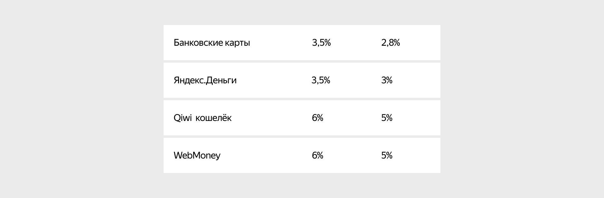
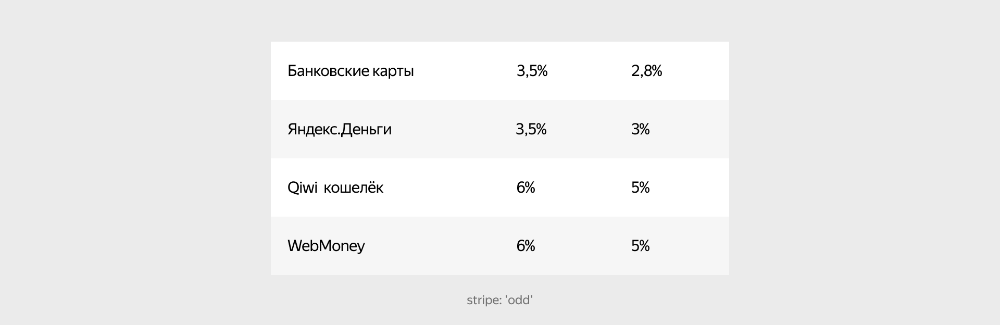
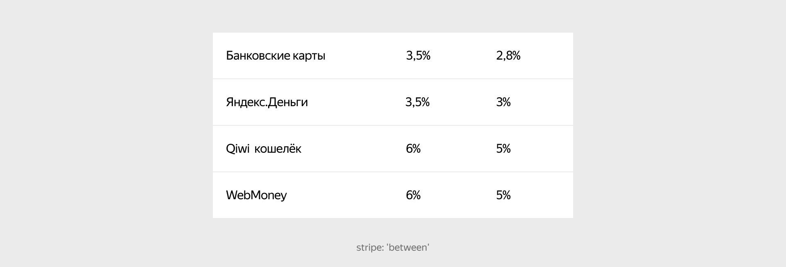
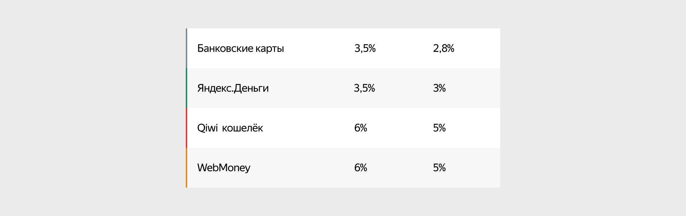

# Таблица

Figma: [https://www.figma.com/file/7kl4eBgLcnK6OYgM01XVig/Patterns?node-id=1%3A217](https://www.figma.com/file/7kl4eBgLcnK6OYgM01XVig/Patterns?node-id=1%3A217)

Паттерн предназначен для отображения простых табличных данных. У него есть набор модификаторов для того, чтобы покрыть максимальное количество как стилистических так и структурных потребностей. 

Управляя отступами внутри ячеек можно дать больше «воздуха» (этот прием часто используется при небольшом количестве контента для того, чтобы увеличить общую массу блока).



```json
{
  block: 'table',
  content: [
    {
      elem: 'row',
      content: [
        {
          elem: 'col',
          elemMods: { width: '50' },
          content: 'Банковские карты'
        },
        {
          elem: 'col',
          elemMods: { width: '25' },
          content: '3,5%'
        },
        {
          elem: 'col',
          elemMods: { width: '50' },
          content: '2,8%'
        }
      ]
    },
    ...
  ]
}
```

Можно сделать строки зебрированными (это позволит легче фокусироваться на каждой отдельной строке в длинных таблицах).



```json
{
  block: 'table',
  mods: { stripe: 'odd' },
  content: [
    {
      elem: 'row',
      content: [
        {
          elem: 'col',
          elemMods: { width: '50' },
          content: 'Банковские карты'
        },
        {
          elem: 'col',
          elemMods: { width: '25' },
          content: '3,5%'
        },
        {
          elem: 'col',
          elemMods: { width: '50' },
          content: '2,8%'
        }
      ]
    },
    ...
  ]
}
```

При малом количестве строк можно отбить их бордерами. Это разграничит информацию, но сохранить целостность блока.



```json
{
  block: 'table',
  mods: { border: 'between' },
  content: [
    {
      elem: 'row',
      content: [
        {
          elem: 'col',
          elemMods: { width: '50' },
          content: 'Банковские карты'
        },
        {
          elem: 'col',
          elemMods: { width: '25' },
          content: '3,5%'
        },
        {
          elem: 'col',
          elemMods: { width: '50' },
          content: '2,8%'
        }
      ]
    },
    ...
  ]
}
```

Также строку можно маркировать под статус (это поможет определить 'успешность' записи без явного указания бейджем)



```json
{
  block: 'table',
  mods: { stripe: 'odd' },
  content: [
    {
      elem: 'row',
      elemMods: { status: 'normal' },
      content: [
        {
          elem: 'col',
          elemMods: { width: '50' },
          content: 'Банковские карты'
        },
        {
          elem: 'col',
          elemMods: { width: '25' },
          content: '3,5%'
        },
        {
          elem: 'col',
          elemMods: { width: '50' },
          content: '2,8%'
        }
      ]
    },
    ...
  ]
}
```

[Модификации](%D0%A2%D0%B0%D0%B1%D0%BB%D0%B8%D1%86%D0%B0%200ff0216ffe7f4354b585016e375e3555/%D0%9C%D0%BE%D0%B4%D0%B8%D1%84%D0%B8%D0%BA%D0%B0%D1%86%D0%B8%D0%B8%204d321c12e25c46f4b202352c35baa74e.csv)

| Название | Значения | Описание |
|-----------|-----------|-----------|
| **border** | `around`, `between` | Параметры обводки таблицы: вокруг всей таблицы или между строками |
| **stripe** | `even`, `odd` | Выделение фона чётных или нечётных строк |
| **vertical-align** | `bottom`, `center`, `top` | Вертикальное выравнивание контента в строках |

## Элементы блока

### Элемент row

Основной дочерний элемент Паттерна  — повторяющаяся табличная строка.

[Модификации](%D0%A2%D0%B0%D0%B1%D0%BB%D0%B8%D1%86%D0%B0%200ff0216ffe7f4354b585016e375e3555/%D0%9C%D0%BE%D0%B4%D0%B8%D1%84%D0%B8%D0%BA%D0%B0%D1%86%D0%B8%D0%B8%20225f1986fe6948d4823316318056b95b.csv)

| Название | Значения | Описание |
|-----------|-----------|-----------|
| **view** | `head` | Оформление строки как шапки таблицы |
| **status** | `alert`, `normal`, `success`, `warning` | Статусная маркировка строки |
| **space-around** | `xs`, `s`, `m`, `l` | Отступы со всех сторон у вложенных элементов |
| **space-horizontal** | `xs`, `s`, `m`, `l` | Отступы по горизонтали у вложенных элементов |
| **space-vertical** | `xs`, `s`, `m`, `l` | Отступы по вертикали у вложенных элементов |

### Элемент col

Элемент `col` отвечает за колонки таблицы. Колонки вкладываются внутрь строк.

[Модификации](%D0%A2%D0%B0%D0%B1%D0%BB%D0%B8%D1%86%D0%B0%200ff0216ffe7f4354b585016e375e3555/%D0%9C%D0%BE%D0%B4%D0%B8%D1%84%D0%B8%D0%BA%D0%B0%D1%86%D0%B8%D0%B8%20a31f431ead8646e281ea69377f184f97.csv)

| Название | Значения | Описание |
|-----------|-----------|-----------|
| **align** | `left`, `center`, `right` | Выравнивание по горизонтали |
| **width** | `5 ... 100` | Ширина ячейки в процентах |

У каждой колонки можно управлять выравниваем содержимого по горизонтали и явно указать ширину и выравнивание содержимого внутри.