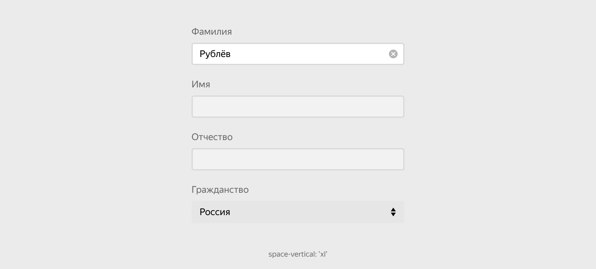

# Форма

Figma: [https://www.figma.com/file/7kl4eBgLcnK6OYgM01XVig/Patterns?node-id=22%3A0](https://www.figma.com/file/7kl4eBgLcnK6OYgM01XVig/Patterns?node-id=22%3A0)

Паттерн `form` — это визуальное представление веб-формы, которая принимает и отправляет данные пользователя.



```json
{
  block: 'form',
  content: [
    {
      elem: 'section',
      content: [
        {
          elem: 'item',
          content: [ ... ]
        },
        ...
      ]
    },
    ...
  ]
}
```

## Живые примеры и дизайн

[Модификаторы блока](%D0%A4%D0%BE%D1%80%D0%BC%D0%B0%205ba4b20cccc246319625cbb1c48f366f/%D0%9C%D0%BE%D0%B4%D0%B8%D1%84%D0%B8%D0%BA%D0%B0%D1%82%D0%BE%D1%80%D1%8B%20%D0%B1%D0%BB%D0%BE%D0%BA%D0%B0%204a1a9d3fcab146c3b15947226ea1b451.csv)


| Модификаторы | Значение | Описание |
|---------------|-----------|-----------|
| **view** | `default` | Фон всей формы |
| **vertical-align** | `bottom`, `center`, `baseline`, `top` | Выравнивание контента в элементах формы |
| **space-vertical** | `xs`, `s`, `m`, `l`, `xl`, `2xl`, `3xl` | Отступы по вертикали у вложенных элементов |
| **structure** | `10–90`, `20–80`, `30–70`, `40–60` | Задает пропорцию между левой и правой частью формы |


[Элементы блока](%D0%A4%D0%BE%D1%80%D0%BC%D0%B0%205ba4b20cccc246319625cbb1c48f366f/%D0%AD%D0%BB%D0%B5%D0%BC%D0%B5%D0%BD%D1%82%D1%8B%20%D0%B1%D0%BB%D0%BE%D0%BA%D0%B0%20d30bf9f45b6047748af2686bde81649e.csv)

| Элемент | Описание |
|----------|-----------|
| **item** | Строчка формы |
| **section** | Логическая группа строк формы |
| **label** | Лейбл для инпута или другого контрола |
| **control** | Контейнер для инпута или другого контрола |


### Элемент section

Обёртка для логической группы элементов `item`. Форма может не иметь section.

[Модификаторы](%D0%A4%D0%BE%D1%80%D0%BC%D0%B0%205ba4b20cccc246319625cbb1c48f366f/%D0%9C%D0%BE%D0%B4%D0%B8%D1%84%D0%B8%D0%BA%D0%B0%D1%82%D0%BE%D1%80%D1%8B%20039eb00070114290ab6dab3cc8dc4f7c.csv)

| Модификатор | Значение | Описание |
|--------------|-----------|-----------|
| **space-vertical** | `xs`, `s`, `m`, `l`, `xl`, `2xl`, `3xl` | Вертикальные отступы |
| **border** | `top`, `bottom`, `both` | Разделители сверху или снизу |

###  Элемент item

Основные дочерние элементы паттерна — элементы `item`.

[Модификаторы элемента](%D0%A4%D0%BE%D1%80%D0%BC%D0%B0%205ba4b20cccc246319625cbb1c48f366f/%D0%9C%D0%BE%D0%B4%D0%B8%D1%84%D0%B8%D0%BA%D0%B0%D1%82%D0%BE%D1%80%D1%8B%20%D1%8D%D0%BB%D0%B5%D0%BC%D0%B5%D0%BD%D1%82%D0%B0%204bab9d0ad6454399887ab66fe5b102bd.csv)

| Модификатор   | Значение                 | Описание                                   |
| ------------- | ------------------------ | ------------------------------------------ |
| **structure** | `horizontal`, `vertical` | Отмена выстраивания элементов в одну линию |

### Элементы label и control

Используются в паре, когда лейбл и контрол должны стоять в одну строку. В этом случае у их родительского `form` должен быть модификатор `structure`.


```json
{
  block: 'form',
  mods: { structure: 'horozontal' },
  content: [
    {
      elem: 'section',
      content: [
        {
          elem: 'item',
          content: [ 
            {
              elem: 'label',
              content: [ ... ]
            }
            {
              elem: 'control',
              content: [ ... ]
            }
          ]
        },
        ...
      ]
    },
    ...
  ]
}
```