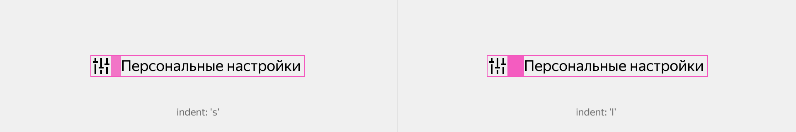
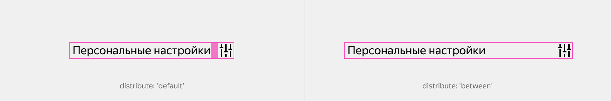
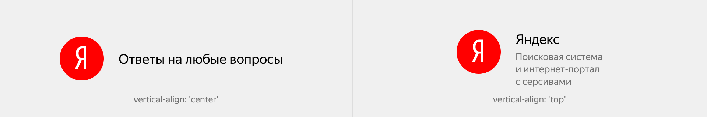

# Ячейка

Figma: [https://www.figma.com/file/7kl4eBgLcnK6OYgM01XVig/Patterns?node-id=1%3A1036](https://www.figma.com/file/7kl4eBgLcnK6OYgM01XVig/Patterns?node-id=1%3A1036)

Небольшой, но достаточно часто встречающийся интерфейсный паттерн, который ставит графический элемент рядом с текстовым. Графический элемент может находиться с любой стороны. У него есть набор модификаторов на отступы и выравнивание по двум осям.

При увеличении контента следует увеличить расстояние между элементами, для этого у элемента `image` используется модификатор indent-right или indent-left c соответствующим значением



```json
{
  block: 'cell',
  mods: { 'indent-right': 's' },
  content: [
    {
      elem: 'image,
      content: [
        {
          block: 'pictogram'
          mods: { name: 'settings', view: 'primary', size: 'm' }
        }
      ]
    },
    {
      elem: 'content',
      content: [
        {
          block: 'text',
          mods: { view: 'primary', size: 'm' },
          content: 'Персональные настройки'
        }
      ]
    }
  ]
}
```

Для отображения навигационных элементов можно изменить порядок. По необходимости элементы можно растаскивать по разным краям сущности.



```json
{
  block: 'cell',
  mods: { distribute: 'between' },
  content: [
    {
      elem: 'content',
      content: [
        {
          block: 'text',
          mods: { view: 'primary', size: 'm' }
          content: 'Персональные настройки'
        }
      ]
    },
    {
      elem: 'image,
      content: [
        {
          block: 'pictogram'
          mods: { name: 'settings', view: 'primary', size: 'm' }
        }
      ]
    }
  ]
}
```

Для центрирования по вертикале у блока используется модификатор vertical-align с соответствующим значением.



```json
{
  block: 'cell',
  mods: { 'indent-right': 'l' },
  content: [
        {
      elem: 'image,
      content: [
        {
          block: 'logo'
          mods: { name: 'yandex', size: 'm' }
        }
      ]
    },
    {
      elem: 'content',
      content: [
        {
          block: 'text',
          mods: { view: 'primary', size: 'm' },
          content: 'Ответы на любые вопросы'
        }
      ]
    }
  ]
}
```

Паттерн отлично подходит для отображения любых списков с пиктограммами, пользовательских блоков с аватарками и именем, и превью статей с изображением и описанием.

## Модификаторы блока

[Модификации](%D0%AF%D1%87%D0%B5%D0%B8%CC%86%D0%BA%D0%B0%2011326de6ef9049e497377937c498ecff/%D0%9C%D0%BE%D0%B4%D0%B8%D1%84%D0%B8%D0%BA%D0%B0%D1%86%D0%B8%D0%B8%20ffa57253543b4c5ab3216628ba0e9cbd.csv)

| Модификаторы | Значение | Описание |
|---------------|-----------|-----------|
| **vertical-align** | `center`, `top`, `baseline` | Вертикальное выравнивание иконки относительно текста |
| **distribute** | `between`, `default` | Распределение контента по горизонтали |
| **indent** | `xs`, `s`, `m`, `l`, `xl` | Отступ между иконкой и контентом |
### Элемент image

Элемент-контейнер для графического элемента может располагаться как до, так и после блока с текстом.

### Элемент content

Элемент в который вкладывается контент, например текст используется без модификаторов.