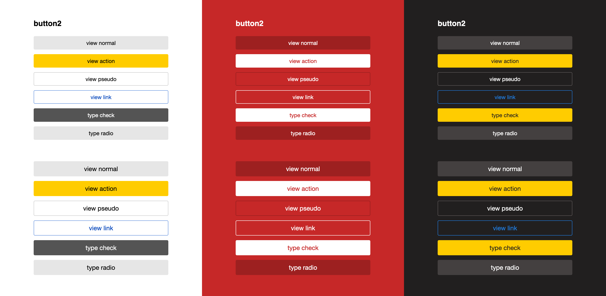

[https://www.npmjs.com/package/@yandex/ui](https://www.npmjs.com/package/@yandex/ui)

Контролы реагируют на уровень Темы также как и все остальные интерфейсные сущности. В уровень Темы добавилось **54 цветовых переменных**, которые отвечаю за все типы поверхностей и содержимого контролов во всех состояниях, при этом они наследуются от тех же базовых переменных, что и цвета интерфейсных блоков и типографики. Они вычисляются через математику путем изменения HSL. 

Для боле полного понимания предварительно рекомендуется подробней прочитать про тематизацию в общем.

Контролы подстраиваются под цветовую схему блока в который они помещаются в зависимости от того, какая модификация theme_color_\* у ближайшего родителя. Это даёт возможность делать разноТематические вставки в рамках одного интерфейса.

Фундаментально это отвечает общему подходу дизайн-системы, при котором в момент формирования любого блока включая контролы указывается только модификатор view отвечающий за смысловое отображение предполагая любую цветовую Тему, в которой он может отобразиться. В то же время формируя Тему предполагается, что в ней может отрисоваться любой контрол. Это позволяет разделить смысл и логику контролов от их внешнего вида.

### Три темы для каждого сервиса

Каждый сервис содержит в себе три основные цветовые Темы:

**theme_*color-**-default** — светлый фон с яркими отображением акцентных контролов и тёмным отображением текста (как правило это используется по-умолчанию);

**theme_*color-**-brand** — яркий фон со светлым отображением акцентных контролов и текста (в основном применяется для вставки маркетинговых блоков);

**theme_*color-**-inverse** — тёмный фон с яркими отображением акцентных контролов и светлым отображением текста (используется для отбивки меню/футера или для «ночной» темы).

## Список контролов доступных для кастомизации

Отталкиваяcь от потребности и частоты использования зафиксировать следующий набор контролов реагирующих на Тему, которые рекомендуется использовать в интерфейсе.

- Attach
- Button
- Checkbox
- Menu
- Progress
- RadioButton
- Radiobox
- Select
- Slider
- Spin
- Textarea
- Textinput
- Tumbler
- Messagebox