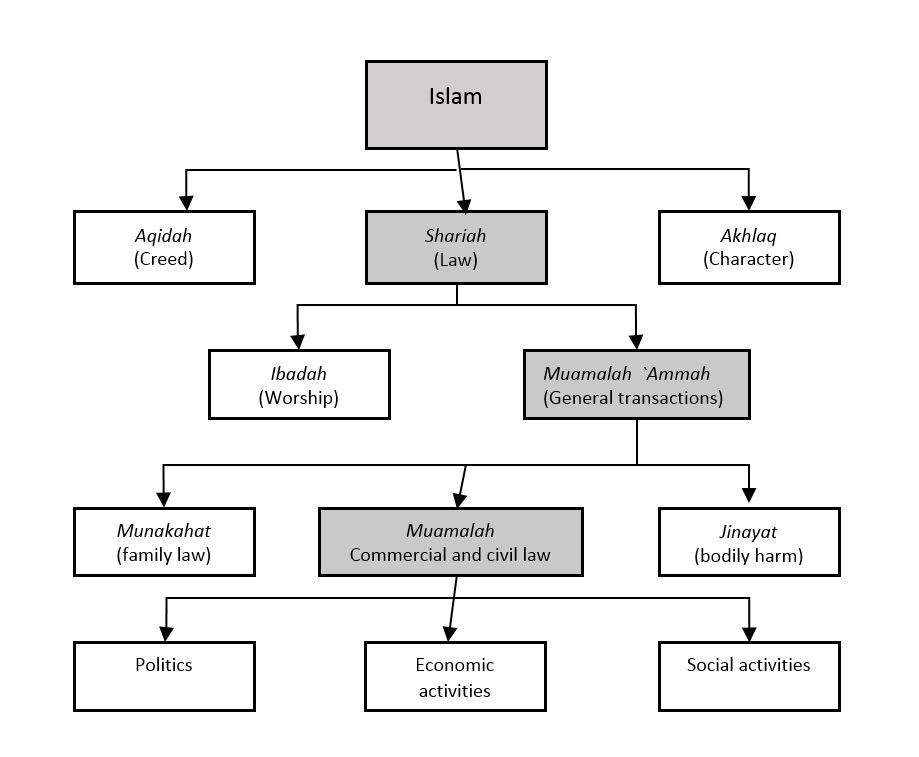

Фонд идей по развитию технологических инициатив для создания платформы представляющей собой основу Цифрового Исламского Мегабанка, который будет покрывать растущие финансовые потребности населения Центральной Азии, Россия, Турции и MENA региона.

Организация будет включать в себя линейку финансовых продуктов для прозрачных торговых отношений между людьми, бизнес-сектором и государством, в соответствии с общечеловеческими этическими нормами, основываясь на разделении прибыли/рисков, являясь альтернативной комплементарной финансовой моделе.

# Миссия
«Наша миссия — очистить экономику стран СНГ от ростовщичества (предоставление денег в долг с условием их возврата с процентами) и предоставить более справедливые инструменты для делового взаимоотношения между людьми»

Сегодняшняя банковская система игнорирует принцип гуманности, и наша миссия преобразовать её в более справедливое состояние основанное на Шариатских Финансовых Стандартов. Наша задача распространить своё видение в страны Средней Азии, Ближнего Востока, России (Северного Кавказа), Турцию и запустить процесс трансформации за счёт проникновения инфраструктуры и цифровых финансовых инструментов в клиентские отрасли.

Одной из самых глобальных проблем является неравномерное распределение ресурсов. И мы хотим влиять на рынок Исламских финансовых услуг, чтобы исправить это положение, предоставляя более справедливые инструменты для делового взаимоотношения между людьми. Поэтому мы помогаем Исламским банкам осуществить цифровую трансформацию и выводить в онлайн финансовые инструменты для розничных клиентов.

Мы помогаем традиционным Исламским банкам (Sharia Comeplined) становиться цифровыми и запускать лучшие клиентские продукты за счёт выстраивания бесшовного клиентского опыта используя банковские API (API Banking) и данные (Open Banking).

## Политические предпосылке

8-го апреля на D-8 президент Турции г-н Эрдоган объявил, что Турция выступает за создание Исламского Мегабанка. Его деятельность будет направлена на обеспечение ликвидности исламских финансовых институтов, а также реализацию инфраструктурных проектов в исламских странах.

По словам турецкого лидера данный Мегабанк может действовать на онлайн-платформе и покрывать растущие финансовые потребности исламского мира.

(Есть тенденция к наращиванию банков, которые работаю на основе Исламского права. Соответственно нам нужно двигаться в сторону создания технологической платформе, инструментам и клиентских сервисов, для того чтобы предоставить пользователям банковские услуги)

К 2023 году Стамбул планирует стать финансовым центром на ровне с Лондоном, Москвой и Куала-Лумпуром.

## Растущий ранок

Учитывая стратегический вектор господина Эрдогана по продвижению концепции Модернизированного Шариатского Государства, Турция становится конкурентным примером для Объединённых Арабских Эмиратов, Ирана и Саудовской Аравии. Значительная часть современной молодёжи начинает изучать религию и через десятилетие в большей степени будет ассоциировать себя с представителями Образованного Современного Многонационального Исламского Мира, который при нужной поддержке стратегических союзников, в виде Российской Федерации, составит здоровую конкуренцию раздробленному западу. 

Такое общество будет нуждаться в соответствующих их уровню культуры и этики финансовых инструментах и клиентских сервисах, что откроет рынок в размере 17 триллионов долларов. Наша команда готова взять ответственность за развитие цифровой платформы и современной экономической системы, базируясь на принципах партнерского финансирования и честного разделения прибыли и рисков. 

Такое отношение в соответствии с Шариатскими принципами поставит человека и его потребности на первое место, что позволит в десятки раз улучшить качество жизни всех слоев населения Стран средний Азии, Регионов Российской Федерации, Турции, Ближнего Востока и Северной Африки. Это позволит нам сформировать экономику общего достатка, обеспечивающую полную финансовую защищённость для всего населения и стабильную среду для развития бизнеса. Такой вектор к 2035 году будет мостиком для перехода к концепции «Золотого Динара», что сможет подчистую искоренить влияние доллара и западной финансовой системы на наш регион. 

Имея многолетний опыт работы в цифровизации и создания ключевых инфраструктурных и финансовых продуктов в Российской Федерации, мы намерены применить свою экспертизу в строительстве Финансового Технологического сектора Турецкой республики, что полностью коррелируется со стратегией Istanbul 2023

## Конкуренция на финансовом рынке средней Азии

На сегодняшний день Средняя Азия является самым перспективными и низко конкурентным рынком для запуска финансовых сервисов, на который претендуют три категории государств:
- Россия;
- Иран / Саудовская Аравия / Турция;
- Китай.

Есть два ключевых политических мейнстрим:
1. Национально-патриотический — на котором основывается Китай.
2. Религиозный — очевидный вектор Ближневосточных лидеров.

Учитывая негативную волну постсоветской романтики, теократическая государственная модель, на наш взгляд, является более справедливой и жизнеспособной для выстраивания процветающего государство и свободной экономической модели. 

Позитивный опыт Шариатской экономики можно увидеть на примере ОАЭ, Омана, Куала-Лумпура и ряда стран Персидского залива. 

Однако шансы на лидерство на этом поле далеко не у всех равны:

1. В виду Шиитской направленности и изоляции, Иран способен найти отклик только у незначительной части Азербайджанской аудитории (в Азербайджане 85% населения причисляют себя к Шиитам) и Таджикской (в виду схожести языка и экономической связанности), что отдаляет его от лидерства в этой тройке;  
2. Саудиты имеют исторический авторитет, но в странах влияния делаетcя упор на арабизацию, что вступает в конфронтацию с многомиллионным пост-Османскими населением;
3. В разрезе следующих 10-20 лет, Турция выглядит гораздо выигрышней в социально-экономическом плане по следующим трём причинам:
	- В культурном аспекте Турция является вторым домом для множества диаспор и имеет тюркскую близость с рядом народов и взглядом лидеров стран Тюркского мира;
	- В религиозном Турция является показательным примером Современного Сунитского Ислама, который находит массовый позитивный отклик у представителей других конфессий и органично интегрированн как в саму атмосферу страны, так и повседневную жизнь граждан.
	- В Географическом Турция умеет территориальную близость с Кавказом и является соседом с Азербайджаном, который в свою очередь через Каспий соединяет её с Казахстаном, Кыргызстан Узбекистаном и Туркменистаном.

Учитывая путь к финансовому лидерству Стамбула, наш вектор лежит в области формирования крепкой инфраструктурной базы в правовом поле Турции, с переиспользованием лучшего цифрового опыта Российских сервисов для потенциальной аудитории в 200 миллионов человек и 17 триллионным потенциалом рынка Шариатских финансовых продуктов, таких как: Процессинг, Дебетовые счета, Страхование, Ипотечное кредитование и развитие инвестиционные платформы для малого и среднего бизнеса.

## Продуктовая линейка

Продукты в которых мы имеем экспертизу:

- Счета и карточные продукты;
- Переводы;
- Оплата услуг;
- Аналитика расходов;
- Платформенные решения.

Более того используя наши финансовые продукты людям не придётся идти на компромисс с самим собой:

- Используя недозволенные процентные продукты для инвестирования;
- Брать ипотеку с грабёжным процентом;
- Вовлекаться в скрытые транзакционные схемы.

## На какой рынок мы идём

Реальные прорывы происходят на развивающихся рынках и в развивающихся странах, они не обременённые наследием в виде давно сложившейся банковской системы.

Наша задача создать единое рыночное пространства, когда финансовые сервисы из различных стран смогут предоставлять свои услуги людям по всей Центральной Азии, Ближнего Востока, Турции и России.

Спецификация и законодательная система на основе которой осуществляется регулирование всех финансовых активностей внутри системы.

## Цели

- Интегрировать цифровые финансовые технологии, которые позволят перераспределить денежные и интеллектуальные ресурсы;
- Добиться экономического суверенитета, доступа к заёмным средствам на Шариатских условиях;
- Позволить ускорить сервисную и цифровую трансформацию, чтобы каждый Восточный Партнёрский Банк кратно превосходил по уровню западные аналоги;
- Сделать финансовые технологии доступные для как можно большей части населения Средней Азии, Турции, России, Ближнего Востока и Северной Африки;
- Повысить количество и качество сделок с учётом этических норм и Шариатского законодательства;
- Создать регион общего достатка с развитой экономикой и финансовой инфраструктурой.

54:05

(Ключевая задача — создать Исламскую Финансовую Систему)
(В западной системе — изначально заложен обман, который позволяет наживаться на людях за счет процента)(Ислам предложил совершенно новаторскую идею, которая на абсолютно других основах позволяет развивать мировую финансовую систему)

# Коротко об Исламской экономике

Чтобы рассказывать об Исламской Экономике, нужно понять, что такое Ислам. Ислам — это религия, которую Всевышний ниспослал каждому из пророков (Адама, Аврама, … Моисея, Иисус, Мухаммада). 

Последние слова Всевышнего были ниспосланным в Священном Коране, заключительному пророку Мухаммаду (с.а.в) для абсолютно всех людей (вне зависимости от нации, пола, места проживания). Ислам это цельная религия, которая укрепляет человека как в вопросах души, так и всего повседневных бытовых делах. Экономика в этом плане является неотъемлемой частью

Все нормы поведения, которые Бог предписал людам регламентированы Шариатом. Шариат представляет собой систему правил на котором строится Исламское Право.

Есть несколько правовых школ (Фикхов)

Суннитсякая группа: Ханафитский, Шафиитски, Маликитский, Хамбалитский мазхабы

Шиитская группа: Джафаритский мазхаб.

Если говорить про экономику, то следует рассмотреть

- Основные ограничении;
- Саму экономическую систему;
- Типы сделок;
- Регуляторку.

## Специфика

В Исламском мире принято считать, что западная финансовая система не только противоречит нормам Ислама, но и несовершенна сама по себе. Альтернативу ей представляет Исламский Банкинг. Принципы Исламского Банкинга запрещают ростовщичество в экономическом и этическом смыслах. Вместо этого Банк становится партнёром с клиентом, разделяя выгоды и риски. 

Исламская экономика охватывает следующие сектора: еда и напитки, одежда и аксессуары, средства информации и развлечения, туризм, фармацевтические препараты и косметика, финансовые инструменты и цифровые технологии. 

Вест капитал должен формироваться на основе созидательной деятельности и торговли. И запрещено 4 вещи

### Риба (ростовщичества),

Под Риба понимается любая неправомерная выгода, полученная вследствие предоставления займа. Растовщичество. Дентги нельзя использовать как актив для получения прибыли. Деньги не являются товаром, который можно купить в рассрочку за крупную сумму.

### Гарар

Запрет неопределенности, возникшей вследствие информационных проблем и относящаяся к любой случайности или неясности условий контракта, возникшей в результате отсутствия информации или контроля в договоре. Так же сюда входит ряд облигаций и любые деревативы()

### Майсир

запрет азарта. В переводе с арабского языка Майсир означает «получение прибыли без усилий»

### Харам

Инвестиции непосредственно в запретную деятельность: Алкоголь, Порнографию, товары в которых есть вред для человека.

## Экономические системы:

- Капитализм (Бизнес)
- Социализм (Государство)
- Исламская экономика (человек)(В Исламе есть баланс между богатством и принципом и принципами социальной справедливости) и (закят являются одним из обязательных столпов религиозной пракики)

**Есть шесть столпов веры (имана):**

1. Вера в Аллаха.
2. Вера в Его ангелов.
3. Вера в Его Книги.
4. Вера в Его посланников и пророков.
5. Вера в Судный день.
6. Вера в предопределение, в то, что все хорошее и плохое происходит по Воле Всевышнего.

**5 столпов религиозной практики**

1. декларация веры, содержащая исповедание единобожия и признание пророческой миссии Мухаммада (шахада);
2. пять ежедневных молитв (намаз);
3. пост во время месяца Рамадан (саум);
4. **религиозный** налог в пользу нуждающихся (закят);
5. паломничество в Мекку (хадж).

## Типы сделок

Вообще вся Исламская экономика это про честное партнерство (разделеение прибыли и рисков)

### Мудараба

Фактически это венчурное инвестирование. Доверительное управление — один предоставляет 100% капитала, а другой экспертизу и время

### Мушарака

Совместное долевое предприятие, в котором инвесторы осуществляют вложения в складчину и делят между собой полученные прибыли или убытки в соответствии с размером пая каждого участника

### Мурабаха

Торговое соглашение, при котором продавец прямо указывает затраты, понесенные им на продаваемые товары, и продает их другому лицу с наценкой к первоначальной стоимости

### Такафуль

Страхование запрещено в Исламе (так как страховой случай может не наступить, а внос человек все равно делает). В Исламском страховании деньги вкладчиков направляются в общий благотворительный фонт и если наступает страховой случай деньги адресно направляются человеку/

### Суккук

Ценные бумаги, которые дают право держать долю от реального актива. Согласно Шариату, банки не могут выплачивать установленный процент. Поэтому суккук представляет собой вы, доходность которых связана с отдачей реальных активов

## Регуляторика и законодательство

1963 — Современный банк появился в Египет когда местные жители не хотели пользоваться банковскими услугами, но они не доверяли западным банкам.

1978’году исламский фонд был открыт в Люксембурге 

Вообще в мире, только два государства у которых финансовая система базируется на Исламских принципах — Иран и Судан

Формально есть две важных составляющих для формирования Исламских банков в стране

- Шариатские сертификации
- И законодательная база. В России для такой законодательной базы

Самое большое распространение Исламский банкинг получил в Малайзии. В 70 были сделаны законодательные корректировки и Duo Banking System. И сейчас 25% от общего числа активов находится под управлением Исламкого банкига 

Сравнивают с ESG повесткой

Исламские институты показывают рост порядка 15 (это может быть обусловленно стартом с низкой базы, но тем несении у людей и ряда отраслей есть запрос на устричные инвестиции)

В России в четырёх регионах заработает ОПФ (Организации партнерского финансирования) с 1 января 2023 года на 2 года.

# Исламский банкинг

Источник: Валдай. Международный дискуссионный клуб  🇷🇺 [https://www.youtube.com/watch?v=7nRA2HZ2r9E&t=5s](https://www.youtube.com/watch?v=7nRA2HZ2r9E&t=5s)

В Исламском мире принято считать, что западная финансовая система не только противоречит нормам Ислама, но и несовершенна сама по себе. Альтернативу ей представляет Исламский Банкинг. Принципы Исламского Банкинга запрещают ростовщичество в экономическом и этическом смыслах. Вместо этого Банк становится партнёром с клиентом, разделяя выгоды и риски. Для этого существуют различные механизмы. К примеру, вместо ипотеки — покупка недвижимости с перепродажей.

Так же не дозволено вкладывать деньги в «запретные» отрасли. Исламскими учёными разработано множество финансовых механизмов, которые частично пересекаются с западными, но имеют свои особенности (долевое финансирование, временное долевое финансирование, страхование, облигации и депозиты).

Основные принципы Исламских Финансов складывались в VIII-XII столетиях, однако в современном виде Банкинг появился только в ХХ веке. Это был Сберегательный Банк «Мит-Гамр», созданный в 1963 году в Египте и работал с нуждами религиозного населения, не доверявшего западным банкам.

Несмотря на скорое закрытие банка по политическим причинам, принципы по которым он работал показали свою эффективность.

Подъем Исламского Банкинга приходится на первую половину 70-х в странах Ближнего Востока:

- Египет – Социальный банк Насер;
- Египет/Судан – Исламский банк Фейсал;
- Кувейт – Кувейтский финансовый дом;
- ОАЭ – Дубайский исламский банк;
- Саудовская Аравия – Исламский банк развития.

Сегодня Исламский Банки существуют в более чем 70 странах, в основном на ближнем Востоке и в Юго-Восточной Азии.

Топ-10 по уровню Исламских Финансовых Активов на 2017 год, по данным Islamic Financial Services Board:

1. Иран – 100%;
2. Судан – 100%;
3. Бруней – 61,8%;
4. Саудовская Аравия – 51,5%;
5. Кувейт – 39,3%;
6. Катар – 25,7%;
7. Малайзия – 24,9%;
8. ОАЭ – 20%;
9. Бангладеш – 19,8%;
10. Джибути – 19%.

Общий объём Исламских финансовых активов составляет более 1,5 триллиона долларов, а их рост в 2009-2013 годах достиг 17%.

Существует распространенное мнение, что Исламский Банкинг работает только с мусульманами, но это ошибка – пользоваться его продуктами могут и представители других религий, и светские люди. Партнёрские банки активно развиваются в западных странах и решают реальные задачи, а их работа основана на доверии и принципах этики. Банк удовлетворяет все финансовые потребности людей, дает большую независимость Исламским странам, представляет востребованный идеал банкинга.

Можно быть уверенными, что в будущем этический подход к финансам будет усиливаться, а банки работающие в соответствии с Шариатскими принципами будут осваивать всё новые территории.

# Основные положения
### Дозволенные формы

#### Счёт и депопозит
##### Амана
Переводится с арабского как «доверие». Это условие обеспечивает контракт на доверительных условиях: при отсутствии у финансового посредника ответственности в случае потерь, если его обязательства были 
выполнены надлежащим образом. В традиционной банковской системе понятию 
амане соответствуют текущие счета или счета до востребования[[4]](https://ru.m.wikipedia.org/wiki/%D0%98%D1%81%D0%BB%D0%B0%D0%BC%D1%81%D0%BA%D0%B8%D0%B9_%D0%B1%D0%B0%D0%BD%D0%BA%D0%B8%D0%BD%D0%B3#cite_note-%D0%A2%D1%80%D1%83%D0%BD%D0%B8%D0%BD-4).

##### Вадиа (wadia, ответственное хранение)

При вадиа банк рассматривается как хранитель и доверительный 
управляющий денежными средствами. Лицо передаёт свои средства на 
хранение в банк, а банк гарантирует возмещение всей суммы [депозита](https://ru.m.wikipedia.org/wiki/%D0%94%D0%B5%D0%BF%D0%BE%D0%B7%D0%B8%D1%82%D0%B0%D1%80%D0%B8%D0%B9)
или какой-либо части по требованию вкладчика. Вкладчик, по-своему 
усмотрению, может уплатить хиба в качестве формы вознаграждения, равно 
как и банк за использование средств клиента.

#### Страхование

##### Такафул (takaful, исламское страхование)

Такафул — альтернативная форма [страхования](https://ru.m.wikipedia.org/wiki/%D0%A1%D1%82%D1%80%D0%B0%D1%85%D0%BE%D0%B2%D0%B0%D0%BD%D0%B8%D0%B5), с помощью которой мусульмане могут защититься от риска убытков по причине [несчастного случая](https://ru.m.wikipedia.org/wiki/%D0%9D%D0%B5%D1%81%D1%87%D0%B0%D1%81%D1%82%D0%BD%D1%8B%D0%B9_%D1%81%D0%BB%D1%83%D1%87%D0%B0%D0%B9). Страхование запрещено исламом, так как страховщик может получать выгоду при заключении контракта без последующего возникновения ущерба страхователя, но последний обязан уплатить взнос (или взносы). Контракт такафул исключает запрещённые исламом элементы (риба, гарар, мейсир), так как основан на принципах взаимной ответственности. Денежные взносы 
направляются в специальный фонд, из средств которого возмещаются убытки 
при наступлении страхового случая. Пропорции распределения денежных 
средств в случае [ущерба](https://ru.m.wikipedia.org/wiki/%D0%A3%D1%89%D0%B5%D1%80%D0%B1) определяются страховой компанией. Свободная часть средств с целью получения прибыли вкладывается в инвестиции, которые организованы по 
принципу разделения прибылей и убытков: все участники [страхового фонда](https://ru.m.wikipedia.org/wiki/%D0%A1%D1%82%D1%80%D0%B0%D1%85%D0%BE%D0%B2%D0%BE%D0%B9_%D1%84%D0%BE%D0%BD%D0%B4)
в равной мере несут потери или разделяют между собой прибыль от 
инвестиционной деятельности. Обычно для этих целей используют модель 
мудараба или викала либо их комбинацию[[4]](https://ru.m.wikipedia.org/wiki/%D0%98%D1%81%D0%BB%D0%B0%D0%BC%D1%81%D0%BA%D0%B8%D0%B9_%D0%B1%D0%B0%D0%BD%D0%BA%D0%B8%D0%BD%D0%B3#cite_note-%D0%A2%D1%80%D1%83%D0%BD%D0%B8%D0%BD-4).

####  Кредит

##### Бай иннах (Bai' bithaman ajil) (торговая сделка с отсроченным платежом)

В контрактах на основе бай иннах, как и таваруке, клиентам банка предоставляются [денежные средства](https://ru.m.wikipedia.org/wiki/%D0%A3%D0%BF%D1%80%D0%B0%D0%B2%D0%BB%D0%B5%D0%BD%D0%B8%D0%B5_%D0%B4%D0%B5%D0%BD%D0%B5%D0%B6%D0%BD%D1%8B%D0%BC%D0%B8_%D1%81%D1%80%D0%B5%D0%B4%D1%81%D1%82%D0%B2%D0%B0%D0%BC%D0%B8) аналогично кредитованию в традиционном банкинге. В отличие от таварука контракт заключается только между двумя сторонами: банком и его 
клиентом. Банк предоставляет клиенту заранее оговорённую сумму в виде 
части [активов](https://ru.m.wikipedia.org/wiki/%D0%90%D0%BA%D1%82%D0%B8%D0%B2%D1%8B_%D0%B1%D0%B0%D0%BD%D0%BA%D0%B0), которая включает наценку за услуги банка. Затем активы сразу же 
продаются  банку по установленной цене, банк выплачивает клиенту всю сумму. Активы возвращаются в банк, клиент получает деньги на свои нужды. Операции происходят с участием [банковских карт](https://ru.m.wikipedia.org/wiki/%D0%91%D0%B0%D0%BD%D0%BA%D0%BE%D0%B2%D1%81%D0%BA%D0%B8%D0%B5_%D0%BE%D0%BF%D0%B5%D1%80%D0%B0%D1%86%D0%B8%D0%B8) и, как правило, с физическими лицами. Некоторые отрицательно относятся к подобного рода операциям, так как они не соответствуют исламу (реальной передачи активов не происходит)[[4]](https://ru.m.wikipedia.org/wiki/%D0%98%D1%81%D0%BB%D0%B0%D0%BC%D1%81%D0%BA%D0%B8%D0%B9_%D0%B1%D0%B0%D0%BD%D0%BA%D0%B8%D0%BD%D0%B3#cite_note-%D0%A2%D1%80%D1%83%D0%BD%D0%B8%D0%BD-4).

##### Таварук (tawarruq)

Буквальный перевод — «превращается в серебро». Этот контракт также 
называют «обратная мурабаха», так как операция является фактическим 
предоставлением кредита. Если банк занимает определённую сумму клиенту, 
он может предоставить ему товар на эту сумму, продавая его с наценкой за
 оказанные услуги ([процент по кредиту](https://ru.m.wikipedia.org/wiki/%D0%91%D0%B0%D0%BD%D0%BA%D0%BE%D0%B2%D1%81%D0%BA%D0%B8%D0%B9_%D0%BA%D1%80%D0%B5%D0%B4%D0%B8%D1%82)).
Контрактом предусматривается то, как клиент рассчитается с банком: по 
частям или одномоментно и в какие сроки. Банк от лица клиента покупает 
товар, а затем перепродаёт его (возможна продажа той же организации, 
которая предоставила товар банку), причём деньги поступают в банк в 
момент продажи, поэтому клиент получает [ликвидные](https://ru.m.wikipedia.org/wiki/%D0%9B%D0%B8%D0%BA%D0%B2%D0%B8%D0%B4%D0%BD%D0%BE%D1%81%D1%82%D1%8C)
 средства. При осуществлении операции товар физически может вообще не 
поступать клиенту, оформление сделки происходит при помощи платёжных 
документов. Как правило, таварук используется многими исламскими банками
 для управления ликвидностью и в качестве способа финансирования при 
расчётах по [кредитным картам](https://ru.m.wikipedia.org/wiki/%D0%9A%D1%80%D0%B5%D0%B4%D0%B8%D1%82%D0%BD%D0%B0%D1%8F_%D0%BA%D0%B0%D1%80%D1%82%D0%B0) и предоставлении кредитов частным лицам. Такой тип финансирования заменяет выдачу [кредита](https://ru.m.wikipedia.org/wiki/%D0%9A%D1%80%D0%B5%D0%B4%D0%B8%D1%82)[[4]](https://ru.m.wikipedia.org/wiki/%D0%98%D1%81%D0%BB%D0%B0%D0%BC%D1%81%D0%BA%D0%B8%D0%B9_%D0%B1%D0%B0%D0%BD%D0%BA%D0%B8%D0%BD%D0%B3#cite_note-%D0%A2%D1%80%D1%83%D0%BD%D0%B8%D0%BD-4).

##### Кард-аль-хасан (qard hassan, хорошая ссуда/благородная ссуда)

Кард-аль-хассан — это [ссуда](https://ru.m.wikipedia.org/wiki/%D0%A1%D1%81%D1%83%D0%B4%D0%B0), предоставляемая банком заёмщику, при этом должник обязан вернуть только основную сумму долга. Он вправе по-своему усмотрению выплатить надбавку — хиба — сверх основной суммы долга (без обещания сделать это) в качестве знака благодарности кредитору и как оплату административных 
расходов. В контракте выплата премиальных не предусматривается. В случае, если должник не оплачивает надбавку кредитору, такая сделка является примером настоящей беспроцентной ссуды. Некоторые мусульмане считают такую ссуду единственным видом ссуды, которая не нарушает запрет риба и не имеет надбавки в виде банковского процента[[4]](https://ru.m.wikipedia.org/wiki/%D0%98%D1%81%D0%BB%D0%B0%D0%BC%D1%81%D0%BA%D0%B8%D0%B9_%D0%B1%D0%B0%D0%BD%D0%BA%D0%B8%D0%BD%D0%B3#cite_note-%D0%A2%D1%80%D1%83%D0%BD%D0%B8%D0%BD-4).

##### Бай муаджал (или Бай битаман аджил) Баи’ аль ‘ина (Bai' al 'inah) (продажа и договор о выкупе)

Буквально «ссуда в форме продажи», торговая сделка с отсроченным платежом. Бай аль ина — это финансовый договор, по которому [кредитор](https://ru.m.wikipedia.org/wiki/%D0%9A%D1%80%D0%B5%D0%B4%D0%B8%D1%82%D0%BE%D1%80) покупает актив у клиента по [спотовой](https://ru.m.wikipedia.org/wiki/%D0%A1%D0%BF%D0%BE%D1%82_(%D1%81%D0%B4%D0%B5%D0%BB%D0%BA%D0%B0)) цене, которая и является «ссудой». В последующем актив перепродаётся клиенту с отсрочкой платежа, разделённого на несколько взносов, что 
представляет собой погашение ссуды. Данные контракты часто заключаются при финансировании гражданского строительства и в других долгосрочных проектах[[2]](https://ru.m.wikipedia.org/wiki/%D0%98%D1%81%D0%BB%D0%B0%D0%BC%D1%81%D0%BA%D0%B8%D0%B9_%D0%B1%D0%B0%D0%BD%D0%BA%D0%B8%D0%BD%D0%B3#cite_note-%D0%91%D0%B0%D0%BD%D0%BA%D0%B8%D0%BD%D0%B3-2).

##### Мусавама (musawamah)

Этот продукту аналогичен мурабаха (торговое финансирование) и 
отличается от операции мурабаха только тем, что при заключении данного 
контракта покупатель и продавец предусматривают фиксированную цену 
товара, в которой не рассматриваются издержки продавца, поэтому такой 
контракт удобен, поскольку не всегда есть возможность точно определить [издержки](https://ru.m.wikipedia.org/wiki/%D0%98%D0%B7%D0%B4%D0%B5%D1%80%D0%B6%D0%BA%D0%B8_%D0%BE%D0%B1%D1%80%D0%B0%D1%89%D0%B5%D0%BD%D0%B8%D1%8F) продавца[[4]](https://ru.m.wikipedia.org/wiki/%D0%98%D1%81%D0%BB%D0%B0%D0%BC%D1%81%D0%BA%D0%B8%D0%B9_%D0%B1%D0%B0%D0%BD%D0%BA%D0%B8%D0%BD%D0%B3#cite_note-%D0%A2%D1%80%D1%83%D0%BD%D0%B8%D0%BD-4).

#####  Ипотека

Сегодня существует три типа исламской ипотеки: иджара (аренда с последующим 
выкупом), мурабаха (торговля на длительный срок) и мушарака (уменьшение 
доли, при совместном владении недвижимостью кредитора и клиента и 
распределение доходов).

**В Мурабаха** банк
 покупает жилье для клиента и продает его с наценкой к первоначальной 
стоимости, продлевая срок оплаты. Окончательная стоимость ясна и 
фиксирована на весь период. Оплачивая в рассрочку, клиент покупает дом у
 банка.

**При иджара**
банк покупает недвижимость и заключает с клиентом договор лизинга. В 
период лизинга все риски, связанные с владением недвижимостью и ее 
приобретением, переходят на банк.

**В мушарака**
продавец, клиент и банк подписывают трехстороннее соглашение. Прибыль 
распределяется между сторонами на заранее оговоренную долю. Затем клиент
постепенно начинает покупать свою долю у банка.

##### Мурабаха (murâbaḥah)

Данный продукт относится к продаже товаров (таких как [недвижимость](https://ru.m.wikipedia.org/wiki/%D0%9D%D0%B5%D0%B4%D0%B2%D0%B8%D0%B6%D0%B8%D0%BC%D0%BE%D1%81%D1%82%D1%8C), товары или транспорт), при которой цена продажи, надбавка и другие 
расходы чётко определены на момент заключения договора продажи. Это 
торговое финансирование. Мурабаха сопровождается договором купли-продажи
 товаров по согласованной цене между банком и его клиентом. Банк от 
имени клиента покупает нужный предпринимателю товар, а затем перепродаёт
 его клиенту. Величина [наценки](https://ru.m.wikipedia.org/wiki/%D0%9D%D0%B0%D1%86%D0%B5%D0%BD%D0%BA%D0%B0) товара — вознаграждение банка — оговаривается заранее. Клиент может выплатить сумму, оговорённую в контракте, постепенно ([аннуитетные](https://ru.m.wikipedia.org/wiki/%D0%90%D0%BD%D0%BD%D1%83%D0%B8%D1%82%D0%B5%D1%82) платежи) или одномоментно в любой срок, который не может быть условием контракта. Банк получает [гарантию](https://ru.m.wikipedia.org/wiki/%D0%93%D0%B0%D1%80%D0%B0%D0%BD%D1%82%D0%B8%D1%8F) в виде [залога](https://ru.m.wikipedia.org/wiki/%D0%97%D0%B0%D0%BB%D0%BE%D0%B3_(%D0%B3%D1%80%D0%B0%D0%B6%D0%B4%D0%B0%D0%BD%D1%81%D0%BA%D0%BE%D0%B5_%D0%BF%D1%80%D0%B0%D0%B2%D0%BE)) (денежного или имущественного)[[4]](https://ru.m.wikipedia.org/wiki/%D0%98%D1%81%D0%BB%D0%B0%D0%BC%D1%81%D0%BA%D0%B8%D0%B9_%D0%B1%D0%B0%D0%BD%D0%BA%D0%B8%D0%BD%D0%B3#cite_note-%D0%A2%D1%80%D1%83%D0%BD%D0%B8%D0%BD-4)..

С развитием исламского банкинга, начало которому положило открытие в 1975 году Исламского банка развития и Дубайского исламского банка[[5]](https://ru.m.wikipedia.org/wiki/%D0%98%D1%81%D0%BB%D0%B0%D0%BC%D1%81%D0%BA%D0%B8%D0%B9_%D0%B1%D0%B0%D0%BD%D0%BA%D0%B8%D0%BD%D0%B3#cite_note-5), мурабаха стал «наиболее используемым» исламским финансовым механизмом.

##### Иджара (Ijarah)

[Иджара](https://ru.m.wikipedia.org/wiki/%D0%98%D0%B4%D0%B6%D0%B0%D1%80%D0%B0) соответствует [лизингу](https://ru.m.wikipedia.org/wiki/%D0%9B%D0%B8%D0%B7%D0%B8%D0%BD%D0%B3)
 в современной банковской системе. В таком соглашении банк покупает 
необходимое клиенту оборудование, недвижимость и т. п., а затем сдаёт 
его клиенту в аренду. [Арендная плата](https://ru.m.wikipedia.org/wiki/%D0%90%D1%80%D0%B5%D0%BD%D0%B4%D0%B0),
её фиксация или изменчивость, а также продолжительность аренды согласуются сторонами. В традиционной банковской системе при лизинге арендатор несёт издержки, связанные с [амортизацией](https://ru.m.wikipedia.org/wiki/%D0%90%D0%BC%D0%BE%D1%80%D1%82%D0%B8%D0%B7%D0%B0%D1%86%D0%B8%D1%8F_(%D0%B1%D1%83%D1%85%D0%B3%D0%B0%D0%BB%D1%82%D0%B5%D1%80%D0%B8%D1%8F)),
страховкой и налогами. В контракте иджара эти издержки несёт арендодатель. Тем не менее, исламский банкинг имеет механизмы, которые позволяют переложить такие издержки на [арендатора](https://ru.m.wikipedia.org/wiki/%D0%90%D1%80%D0%B5%D0%BD%D0%B4%D0%B0).В некоторых вариантах, обычно для среднесрочных и долгосрочных операций, в контракте инджара возможна продажа банком клиенту права 
пользования своей собственностью и доходами от неё.

##### Иджара ва иктина, иджара тумма аль бай (Ijarah thumma al bai, аренда с правом выкупа)

Подобный [контракт](https://ru.m.wikipedia.org/wiki/%D0%94%D0%BE%D0%B3%D0%BE%D0%B2%D0%BE%D1%80) — аналог контракта лизинга с последующим выкупом в традиционном банкинге. Имущество переходит к клиенту за определённую сумму на 
определённый период. Сумма, оговорённая в контракте, не может изменяться
 независимо от того, на какой срок он заключён. Выплаты происходят 
частями, они включают арендную плату и часть конечной стоимости 
продукта. По истечении срока аренды имущество переходит в собственность 
клиента[[4]](https://ru.m.wikipedia.org/wiki/%D0%98%D1%81%D0%BB%D0%B0%D0%BC%D1%81%D0%BA%D0%B8%D0%B9_%D0%B1%D0%B0%D0%BD%D0%BA%D0%B8%D0%BD%D0%B3#cite_note-%D0%A2%D1%80%D1%83%D0%BD%D0%B8%D0%BD-4).

##### Мушарака (musharakah, совместное предприятие)

Мушарака — совместный проект банка и бизнеса. Банк и клиент  подписывают соглашения о партнёрстве, в котором стороны обязуются  совместно финансировать какой-либо проект. В прилагаемом к соглашению 
договоре оговариваются пропорции получения прибыли от 
предпринимательской деятельности и оплата потерь. Банк может заранее 
выплатить клиенту часть прибыли. В соглашении могут принимать участие 
несколько сторон, в управлении могут участвовать, как каждая из сторон, 
так и назначенный управляющий. Такой контракт удобен своей гибкостью, 
так как есть возможность заранее договориться о долях при распределении 
прибыли и форме управления. Фактически, мушарака представляет собой [портфельные инвестиции](https://ru.m.wikipedia.org/wiki/%D0%9F%D0%BE%D1%80%D1%82%D1%84%D0%B5%D0%BB%D1%8C%D0%BD%D1%8B%D0%B5_%D0%B8%D0%BD%D0%B2%D0%B5%D1%81%D1%82%D0%B8%D1%86%D0%B8%D0%B8) в [инвестиционные проекты](https://ru.m.wikipedia.org/wiki/%D0%98%D0%BD%D0%B2%D0%B5%D1%81%D1%82%D0%B8%D1%86%D0%B8%D0%BE%D0%BD%D0%BD%D1%8B%D0%B9_%D0%BF%D1%80%D0%BE%D0%B5%D0%BA%D1%82) и используется в совместной инвестиционной деятельности, для пополнения [оборотных средств](https://ru.m.wikipedia.org/wiki/%D0%9E%D0%B1%D0%BE%D1%80%D0%BE%D1%82%D0%BD%D1%8B%D0%B9_%D0%BA%D0%B0%D0%BF%D0%B8%D1%82%D0%B0%D0%BB) компании, для вложений в недвижимость[[4]](https://ru.m.wikipedia.org/wiki/%D0%98%D1%81%D0%BB%D0%B0%D0%BC%D1%81%D0%BA%D0%B8%D0%B9_%D0%B1%D0%B0%D0%BD%D0%BA%D0%B8%D0%BD%D0%B3#cite_note-%D0%A2%D1%80%D1%83%D0%BD%D0%B8%D0%BD-4).

##### Сукук

** Исламские ценные бумаги **

Сукук (мн.ч. от сакк) — арабское название финансовых [сертификатов](https://ru.m.wikipedia.org/wiki/%D0%A1%D0%B5%D1%80%D1%82%D0%B8%D1%84%D0%B8%D0%BA%D0%B0%D1%82), которые имеют некоторые общие черты с традиционными [ценными бумагами](https://ru.m.wikipedia.org/wiki/%D0%A6%D0%B5%D0%BD%D0%BD%D0%B0%D1%8F_%D0%B1%D1%83%D0%BC%D0%B0%D0%B3%D0%B0), поэтому обычно называются исламские ценные бумаги. Они являются финансовым свидетельством, документом, подтверждающим право держателя на реальный определённый актив[[6]](https://ru.m.wikipedia.org/wiki/%D0%98%D1%81%D0%BB%D0%B0%D0%BC%D1%81%D0%BA%D0%B8%D0%B9_%D0%B1%D0%B0%D0%BD%D0%BA%D0%B8%D0%BD%D0%B3#cite_note-6). Согласно шариату, банки не могут начислять проценты на ценные бумаги, поэтому исламский [банкинг](https://ru.m.wikipedia.org/wiki/%D0%91%D0%B0%D0%BD%D0%BA%D0%BE%D0%B2%D1%81%D0%BA%D0%B8%D0%B5_%D0%BE%D0%BF%D0%B5%D1%80%D0%B0%D1%86%D0%B8%D0%B8) использует специальный вид [облигаций](https://ru.m.wikipedia.org/wiki/%D0%9E%D0%B1%D0%BB%D0%B8%D0%B3%D0%B0%D1%86%D0%B8%D1%8F) — сукук. Их доходность связана с отдачей от реальных активов. Облигации сукук выпускаются в соответствии со стандартным процессом [секьюритизации](https://ru.m.wikipedia.org/wiki/%D0%A1%D0%B5%D0%BA%D1%8C%D1%8E%D1%80%D0%B8%D1%82%D0%B8%D0%B7%D0%B0%D1%86%D0%B8%D1%8F), в котором разработан механизм, позволяющий приобретать активы и создана возможность формировать финансовые обязательства по отношению к ним  (риск и доходность ценных бумаг перекладывается на их держателей). 
Проекты, по которым предусматривается выпуск облигаций сукук, должны соответствовать нормам шариата. Основной контракт, который используется в процессе секьюритизации для выпуска — мудараба. Сукук нужны для создания организаций, таких как Special Purpose Modaraba (SPM), 
аналогичных традиционным (Special Purpose Vehicle ([SPV](https://ru.m.wikipedia.org/wiki/SPV)), выпускающих собственные [ценные бумаги](https://ru.m.wikipedia.org/wiki/%D0%A6%D0%B5%D0%BD%D0%BD%D0%B0%D1%8F_%D0%B1%D1%83%D0%BC%D0%B0%D0%B3%D0%B0), которые затем финансируют [инвестиционные](https://ru.m.wikipedia.org/wiki/%D0%98%D0%BD%D0%B2%D0%B5%D1%81%D1%82%D0%B8%D1%86%D0%B8%D0%B8)
 проекты своего учредителя. Наибольшая часть облигаций сукук в 
современной финансовой системе ислама основана на двух исламских 
контрактах: салям, или бай салям и бай муаджал. Облигации сукук аль 
салям — удобный [инвестиционный механизм](https://ru.m.wikipedia.org/wiki/%D0%98%D0%BD%D0%B2%D0%B5%D1%81%D1%82%D0%B8%D1%86%D0%B8%D0%BE%D0%BD%D0%BD%D1%8B%D0%B9_%D0%BC%D0%B0%D1%80%D0%BA%D0%B5%D1%82%D0%B8%D0%BD%D0%B3) при коротких сроках погашения: от трёх месяцев до года. Но поскольку это финансовые ценные бумаги, шариат рассматривает их как [долговые обязательства](https://ru.m.wikipedia.org/wiki/%D0%94%D0%BE%D0%BB%D0%B3%D0%BE%D0%B2%D0%BE%D0%B5_%D0%BE%D0%B1%D1%8F%D0%B7%D0%B0%D1%82%D0%B5%D0%BB%D1%8C%D1%81%D1%82%D0%B2%D0%BE), и многие инвесторы в исламских странах не могут торговать облигациями сукук на вторичном рынке, так как может возникнуть риба. Поэтому многие 
инвесторы стремятся держать облигации сукук аль салям до самого [срока погашения](https://ru.m.wikipedia.org/wiki/%D0%94%D0%BE%D1%85%D0%BE%D0%B4%D0%BD%D0%BE%D1%81%D1%82%D1%8C_%D0%BA_%D0%BF%D0%BE%D0%B3%D0%B0%D1%88%D0%B5%D0%BD%D0%B8%D1%8E).
Другой тип облигаций основывается на контрактах иджара (сукук аль иджара). Они используются для выпуска ценных бумаг с длительным сроком  [погашения](https://ru.m.wikipedia.org/wiki/%D0%9E%D0%B1%D0%B5%D1%81%D0%BF%D0%B5%D1%87%D0%B5%D0%BD%D0%BD%D1%8B%D0%B5_%D0%BE%D0%B1%D0%BB%D0%B8%D0%B3%D0%B0%D1%86%D0%B8%D0%B8). Контракт иджара наиболее близок к общепринятому лизинговому контракту и позволяет обеспечить гибкие выплаты как с фиксированной, так и с [плавающей ставкой](https://ru.m.wikipedia.org/wiki/%D0%9F%D0%BB%D0%B0%D0%B2%D0%B0%D1%8E%D1%89%D0%B0%D1%8F_%D0%BF%D1%80%D0%BE%D1%86%D0%B5%D0%BD%D1%82%D0%BD%D0%B0%D1%8F_%D1%81%D1%82%D0%B0%D0%B2%D0%BA%D0%B0)[[4]](https://ru.m.wikipedia.org/wiki/%D0%98%D1%81%D0%BB%D0%B0%D0%BC%D1%81%D0%BA%D0%B8%D0%B9_%D0%B1%D0%B0%D0%BD%D0%BA%D0%B8%D0%BD%D0%B3#cite_note-%D0%A2%D1%80%D1%83%D0%BD%D0%B8%D0%BD-4).

Согласно данным, опубликованным Исламским советом финансовых 
услуг, общая сумма непогашенных сукук на конец 2014 года составила 
294 млрд.$, из которых 188 млрд.$ приходилось на Азию, а 95,5 млрд.$ — 
на страны Совета по сотрудничеству стран [Персидского залива](https://ru.m.wikipedia.org/wiki/%D0%9F%D0%B5%D1%80%D1%81%D0%B8%D0%B4%D1%81%D0%BA%D0%B8%D0%B9_%D0%B7%D0%B0%D0%BB%D0%B8%D0%B2).

##### Мукарада (сукук аль мукарада)

Это исламские ценные [облигации](https://ru.m.wikipedia.org/wiki/%D0%9E%D0%B1%D0%BB%D0%B8%D0%B3%D0%B0%D1%86%D0%B8%D1%8F), направленные на финансирование конкретных проектов. Их держатели  (подобно владельцам неголосующих акций) имеют право на участие в прибыли в случае успешной реализации проекта, но также принимают на себя часть убытков. Банк не гарантирует выплату сумм долга или прибыли.

##### Истисна

Этот продукт относится к [деривативам](https://ru.m.wikipedia.org/wiki/%D0%9F%D1%80%D0%BE%D0%B8%D0%B7%D0%B2%D0%BE%D0%B4%D0%BD%D1%8B%D0%B9_%D1%84%D0%B8%D0%BD%D0%B0%D0%BD%D1%81%D0%BE%D0%B2%D1%8B%D0%B9_%D0%B8%D0%BD%D1%81%D1%82%D1%80%D1%83%D0%BC%D0%B5%D0%BD%D1%82), которые функционируют в исламской финансовой системе. Применяется, как правило, при финансировании масштабных и продолжительных проектов. Цена контракта устанавливается на день заключения соглашения, а выплаты и 
другие расчёты происходят по графику, согласованному сторонами. [График](https://ru.m.wikipedia.org/wiki/%D0%93%D1%80%D0%B0%D1%84%D0%B8%D0%BA), как правило, детально разработан: сроки выполнения, сумма, качество  работ и т. д. Также предусмотрено неукоснительное выполнение заключённого соглашения. Сроки реализации проекта могут изменяться по согласованию сторон, но сумма остаётся неизменной. Практика заключения данного контракта происходит, обычно по схеме:

- клиент обращается в банк с чётким описанием проекта нового производства, приобретения имущества или строительства, который подвергается экономической [экспертизе](https://ru.m.wikipedia.org/wiki/%D0%AD%D0%BA%D1%81%D0%BF%D0%B5%D1%80%D1%82%D0%B8%D0%B7%D0%B0) с позиции исламских традиций;
- клиенту сообщается о соглашении или отказе реализации проекта;
- банк подписывает соглашение с производителем (строительной или иной организацией) о реализации проекта в установленный срок;
- клиент принимает результаты работы;
- клиент оплачивает услуги банка в соответствии с контрактом.

#### Привелечние средств

##### Мудараба (mudarabah)

Мудараба или контракт распределения [прибыли](https://ru.m.wikipedia.org/wiki/%D0%9F%D1%80%D0%B8%D0%B1%D1%8B%D0%BB%D1%8C) и [убытков](https://ru.m.wikipedia.org/wiki/%D0%A3%D0%B1%D1%8B%D1%82%D0%BE%D0%BA) — это вид партнёрства, при котором один из партнёров предоставляет другому деньги для инвестирования в коммерческое предприятие. Капитальные инвестиции, как правило, должны осуществлять оба партнёра[[4]](https://ru.m.wikipedia.org/wiki/%D0%98%D1%81%D0%BB%D0%B0%D0%BC%D1%81%D0%BA%D0%B8%D0%B9_%D0%B1%D0%B0%D0%BD%D0%BA%D0%B8%D0%BD%D0%B3#cite_note-%D0%A2%D1%80%D1%83%D0%BD%D0%B8%D0%BD-4).

Мудараба (распределение прибыли) — это контракт, в рамках которого одна из сторон предоставляет 100 % [капитала](https://ru.m.wikipedia.org/wiki/%D0%9A%D0%B0%D0%BF%D0%B8%D1%82%D0%B0%D0%BB), а другая предоставляет свои специальные знания и опыт, необходимые для инвестирования капитала и управления инвестиционным проектом. Полученнаяприбыль распределяется между сторонами согласно заранее согласованному 
соотношению. В случае убытка, первый партнёр рабб ул-мал (rabb-ul-mal) 
потеряет свой капитал, а второй партнёр мудариб (mudarib) потеряет время и приложенные усилия. Бизнесмен не имеет права без разрешения банка 
направлять полученные от банка денежные средства на другие проекты, не 
предусмотренные контрактом, привлекать другие источники финансирования и
 использовать свои денежные средства. Прибыль распределяется в 
зависимости от договорённости — 50/50 или 60/40 для рабб-ул-мал, в 
стандартных контрактах, как правило, банк получает 15-30% от прибыли[[4]](https://ru.m.wikipedia.org/wiki/%D0%98%D1%81%D0%BB%D0%B0%D0%BC%D1%81%D0%BA%D0%B8%D0%B9_%D0%B1%D0%B0%D0%BD%D0%BA%D0%B8%D0%BD%D0%B3#cite_note-%D0%A2%D1%80%D1%83%D0%BD%D0%B8%D0%BD-4).

Согласно экономисту Тарик M.Йосефу, долгосрочное финансирование 
мудараба или мушарака (в которых применяется механизм распределения 
прибыли и убытков) «намного более рискованное и [затратное](https://ru.m.wikipedia.org/wiki/%D0%97%D0%B0%D1%82%D1%80%D0%B0%D1%82%D1%8B)», чем долгосрочное или краткосрочное заимствование традиционных банков. Таким образом, существуют расхождения между теорией исламских финансов, основанной на использовании имущества, и реальностью с доминирующим применением исламскими банками практики мурабаха.

[Викала (доверенность)](Викала%20(доверенность).md)
Викала — это аналог [представительства](https://ru.m.wikipedia.org/wiki/%D0%9F%D1%80%D0%B5%D0%B4%D1%81%D1%82%D0%B0%D0%B2%D0%B8%D1%82%D0%B5%D0%BB%D1%8C%D1%81%D1%82%D0%B2%D0%BE) в традиционной [финансовой системе](https://ru.m.wikipedia.org/wiki/%D0%A4%D0%B8%D0%BD%D0%B0%D0%BD%D1%81%D0%BE%D0%B2%D0%B0%D1%8F_%D1%81%D0%B8%D1%81%D1%82%D0%B5%D0%BC%D0%B0). Может использоваться для возможности одной стороне (агенту) представлять интересы другой в качестве [доверенного лица](https://ru.m.wikipedia.org/wiki/%D0%94%D0%BE%D0%B2%D0%B5%D1%80%D0%B5%D0%BD%D0%BD%D0%BE%D0%B5_%D0%BB%D0%B8%D1%86%D0%BE). В контракте викала указывается фиксированная плата, которую получает агент, не участвуя в прибылях и убытках. При заключении этого контракта банк может действовать от имени клиента, используя средства, размещённые на депозитных счетах клиента.

#### Предоплата

##### Бай салям (bai salam)

Бай салям означает контракт с предусмотренной и оговорённой заранее [предоплатой](https://ru.m.wikipedia.org/wiki/%D0%90%D0%B2%D0%B0%D0%BD%D1%81)
 за товары, которые будут поставлены через некоторое (также определённое
 контрактом) время. Это покупка с авансовым платежом. Товар с точки 
зрения шариата и законодательства [страны](https://ru.m.wikipedia.org/wiki/%D0%98%D1%81%D0%BB%D0%B0%D0%BC%D1%81%D0%BA%D0%B8%D0%B5_%D1%81%D1%82%D1%80%D0%B0%D0%BD%D1%8B)
 должен быть разрешённым. Контракт бай салям заключается только тогда, 
когда товар не находится в собственности продавца на момент [сделки](https://ru.m.wikipedia.org/wiki/%D0%A1%D0%B4%D0%B5%D0%BB%D0%BA%D0%B0).
 Во время заключения контракта чётко определяется качество, количество и
 специфические характеристики товара, предназначенного для покупки, без 
каких-либо неточностей, которые могут привести к возникновению спора в 
будущем. Объектами продажи могут быть товары, и не могут быть: золото, 
серебро или валюта, основанная на этих металлах. Вводя такой запрет, бай
 салям охватывает практически все, что можно точно описать в контексте 
количества, качества и изготовления. Применяется, главным образом, в 
аграрном и других производственных секторах[[4]](https://ru.m.wikipedia.org/wiki/%D0%98%D1%81%D0%BB%D0%B0%D0%BC%D1%81%D0%BA%D0%B8%D0%B9_%D0%B1%D0%B0%D0%BD%D0%BA%D0%B8%D0%BD%D0%B3#cite_note-%D0%A2%D1%80%D1%83%D0%BD%D0%B8%D0%BD-4).Основные характеристики и условия бай салям

- Операция считается салям, если покупатель полностью оплатил продавцу продажную цену в момент продажи. Это необходимо для того, чтобы покупатель могпоказать, что он не приобретает долг перед вторым лицом, чтобы покрытьсвой долг перед первым лицом (что запрещено шариатом). Идея салам обычно отличается от других по количеству, размеру или весу, при этом точнаяхарактеристика обычно невозможна.

- Салям не может применяться в отношении конкретного товара или изделия с конкретного поля или фермы. Например, если продавец обязуется поставить зерно с конкретного поля или фрукты с конкретного дерева, салям не будет действителен, поскольку существует вероятность, что урожай с этого конкретного поля или фрукты с этого дерева будут уничтожены, что делает поставку неопределённой.

- Необходимо, чтобы качество товара (предмет саляма) было полностью оговорено и все возможные детали в этом отношении должны быть указаны в прямой форме.

- Также необходимо, чтобы количество товара было окончательно согласовано. Если товар измеряется весом, то должен быть указан вес. Если он измеряется размерами, то должны быть указаны размеры.

- В контракте должны быть определены точная дата и место.

- Салям не может распространяться на предметы, которые должны быть поставлены в рамках спотовой сделки. Например, если товар был приобретён в обмен на серебро, согласно шариату, необходимо обеспечить одновременную поставку. Здесь салям не может применяться. Аналогичным образом, если зерно обменивается на ячмень, то для действительности продажи необходима одновременная поставка. Таким образом, контракт салям в данном случае не допустим.

- Это наиболее предпочтительная финансовая сделка, которая обеспечивает высокий уровень соблюдения норм шариата.

- Торговля исламскими ценными бумагами с использованием формата салям была запрещена AAOIFI, но на иранском рынке долговых обязательств салям является обычной формой сукук.

### Запрещенные формы

#### Риба

Одним из основополагающих принципов исламских финансов является отказ от получения дохода в виде процента по вкладам и долгам – **рибы**. Рибой (ростовщичеством) считается любая необоснованная прибавка (надбавка), в которой относятся, в частности, проценты по кредитам и депозитам.

#### Гарар

По канонам ислама, дохода следует добиваться посредством реальной 
экономической деятельности – торговли, производства, капиталовложений и 
т.п. Доход, полученный посредством деятельности, эквивалентной азартной 
игре, мусульмане не считают дозволенным. В этой связи стоит привести 
 понятие **майсир** в буквальном переводе с арабского —  
«азартная игра», получение прибыли в результате случайного стечения
обстоятельств, сюда относится выигрыш в рулетку, по лотерейному билету, 
получение прибыли по деривативам и откровенно спекулятивное поведение 
(игра) на финансовых рынках.

#### Майсир

По канонам ислама, дохода следует добиваться посредством реальной 
экономической деятельности – торговли, производства, капиталовложений и 
т.п. Доход, полученный посредством деятельности, эквивалентной азартной 
игре, мусульмане не считают дозволенным. В этой связи стоит привести 
понятие **майсир** — в буквальном переводе с арабского —  
«азартная игра», получение прибыли в результате случайного стечения 
обстоятельств, сюда относится выигрыш в рулетку, по лотерейному билету, 
получение прибыли по деривативам и откровенно спекулятивное поведение 
(игра) на финансовых рынках.

Также в исламе налагается запрет на сделки по продаже имущества, 
которым продавец не владеет, которого нет в наличии. Речь идет о **гараре**  
(«опасность») — элементе неопределённости, случайности или неясности в 
предмете договора или в отношении цены товара. В бытовом понимании это 
означает, что нельзя совершать куплю-продажу рыбы в море, которая еще не
 была поймана, фруктов, которые еще не начали поспевать на дереве, или 
еще неродившегося теленка. В финансовом плане с чрезмерной 
неопределенностью сопряжены деривативы, такие как опционы, фьючерсы, 
свопы и т.д. Также в число запрещенных входят короткие сделки на рынке 
акций. Отметим, что шариат не запрещает гарар полностью, ведь 
неопределенность связана с риском, а риск является элементом любого 
договора. Запрещен только чрезмерный, необоснованный гарар.

## Продуктовая линейка

### Дебетовые карты

- Бесплатная доставка в любую точку мира;
- Бесплатное обслуживание;
- Валютные счета;
- Системы лояльности;
- Качественный UX;
- Персональная поддержка.

### Переводы

- Международные переводы (Россия - Казахстан - Узбекистан - Таджикистан)

### Персональный финансовый менеджер

- Импорт истории из любых банка
- Аналитика трат подкатегориям
- Вишлисты и Накопительные счета
- Прогнозирование трат
- Система управления подписками
- Поиск скидок на запланированные ругулярные покупки

### Благотворительность

- Расчёт и выплата «Закат»;
- «Садака» добровольная поддержка людей, которые в этом нуждаются.

### Инвестиции

- Инвестиции «Сукук» в реальный сектор экономики: (имеющие низкие риски, но небольшую маржинальность);
- Инвестиции в SaaS решения автоматизирующие бизнес (имеет высоки риски, но большой возврат инвестиция)[доставка еды, доставка лекарств, уборка квартир, выгул и уход за животными, …];

### Ипотечное кредитование

- Беспроцентная ипотека

### Уникальные продукты

- Сукук — Для клиента это инвестиции / покупка бонд. Для банка — это ранзакционный бизнес (заработок на комиссии)
- Такафул — Для килиента это страхование жизни / недвижимости. Для банка — это заработок на выплате гонораров за размещение денег клиентов в фонже
- Ипотека (Иджар / Мурабха / **Мушарака**) — для клиента это ипотека без процентов. Для банка заработок на надбавке (риски на неверном расчёте инфляции)

Исламский банкинг как прекрасный способ борьбы с инфляцией, так как любые деньги который производят качественный товар или услугу продолжают сохранять свою ценность. Мировой финансовый рынок постоянно уходить в отрыв от реальных товаров и услуг. Исламские финансовые принципы позволяют сдерживать тот бланс. В Исламской экономике деньги привязываются к активу / к собственности.

В Исламском банкинге во главу угла ставиться вопрос ответствености (Адалет Джабиев.)

Партнёрство — это ключевая парадигма (фундаментальный смысмс) Исламского банкинга

Предоставляе финансовые услуги у меня есть нравственная потребность зарабатывать этичным принципам (учитывая Авраамические традиции)

### Примеры сервисов
- [https://rcief.org/](https://rcief.org/)
- [http://www.kazanriu.ru/](http://www.kazanriu.ru/)
- [https://iaib.world/ru/](https://iaib.world/ru/)
- [https://www.dinarstandard.com/](https://www.dinarstandard.com/)
- [https://kazansummit.ru/](https://kazansummit.ru/)
- [https://m.facebook.com/sistersbazaarkz/?locale2=ru_RU](https://m.facebook.com/sistersbazaarkz/?locale2=ru_RU)
- [https://www.zawya.com/giei/](https://www.zawya.com/giei/)
- [https://www.iaea.org/ru/o-nas/islamskiy-bank-razvitiya-ib](https://www.iaea.org/ru/o-nas/islamskiy-bank-razvitiya-ibr)

### Книги и источники

«Чтобы рассказывать об Исламской Экономике, нужно понять, что такое Ислам. Ислам — это религия, которую Всевышний ниспослал каждому из пророков (Адама, Аврама, … Моисея, Иисус, Мухаммада). 

Последние слова Всевышнего были ниспосланным в Священном Коране, заключительному пророку Мухаммаду (с.а.в) для абсолютно всех людей (вне зависимости от нации, пола, места проживания). 

Ислам это цельная религия, которая укрепляет человека как в вопросах души, так и всего повседневных бытовых делах. Экономика в этом плане является неотъемлемой частью»

## Базовые книги

- Абу Юсуф аль-Ансари «Китаб ал-харадж»
- Мухаммада Аш-Шайбани «Получение хорошего заработка»
- Абу Убайда ибн аль-Джаррах «Аль-Амуаль»
- Аль-Газали (нет одной книге, но в своих трудах он много говорил офункции денег)

## Cовременные книги

- Исламское страхование. Стандарт №26 [https://barakat-shop.ru/catalog/knigi-i-diski/nauchnaya-literatura/islamskoe-strakhovanie-standart-26.html](https://barakat-shop.ru/catalog/knigi-i-diski/nauchnaya-literatura/islamskoe-strakhovanie-standart-26.html)
- Шариатские Стандарты [www.ifexpert.ru](http://www.ifexpert.ru/)

## Исследования

- Сколково «Иcламская экономика — самая быстрорастущая крупнаая экономика. евразийский фокус» [https://iems.skolkovo.ru/downloads/documents/SKOLKOVO_IEMS/Research_Reports/SKOLKOVO_IEMS_Research_2018-07-04_ru.pdf](https://iems.skolkovo.ru/downloads/documents/SKOLKOVO_IEMS/Research_Reports/SKOLKOVO_IEMS_Research_2018-07-04_ru.pdf)

## Самая быстрорастущая экономика

Документ:[https://iems.skolkovo.ru/downloads/documents/SKOLKOVO_IEMS/Research_Reports/SKOLKOVO_IEMS_Research_2018-07-04_ru.pdf](https://iems.skolkovo.ru/downloads/documents/SKOLKOVO_IEMS/Research_Reports/SKOLKOVO_IEMS_Research_2018-07-04_ru.pdf?fbclid=IwAR2P_d2j-TcM_DejC9_MdWGELDOJPSCaRFirJnEYzSck-wy6wqysj5XVgGM)

«Исламская экономика — это знание и применение норм шариата, которые помогают не допустить неправедного использования материальных ресурсов, удовлетворить потребности людей и дать людям возможность выполнить свои обязательства перед Богом и обществом». 

Так было впервые сформулировано общепризнанное и четкое определение термина «исламская экономика»

Впервые термин «Исламская экономика» встречается в книге «Ислами маашийят» («Исламская экономика»), написанной исламским ученым Сайидом Маназиром Ашаном Гилани и опубликованной в 1947 году на урду. 

По словам Гилани, Исламская экономика — это идеальная экономическая система, которая соответствует канонам Ислама.

Исламская экономика охватывает следующие сектора: еда и напитки, одежда и аксессуары, средства информации и развлечения, туризм, фармацевтические препараты и косметика, финансовые инструменты и цифровые технологии. 

Однако с учетом степени развития Исламской экономики в Евразии нам потребуется более общий термин: исламская экономическая «Экосистема»

Халяльный образ жизни в значительной степени согласуется с современными моделями поведения людей, которые предпочитают органическую и безопасную пищу и соблюдают принципы социально ответственного и экологичного производства.

Общее количество мусульман в евразийском регионе достигло около 86 миллионов, что сопоставимо с населением таких стран, как Германия или Иран. 

Численность мусульман-миллениалов в регионе составляет более 50 миллионов человек или 58% всего мусульманского населения.

Поскольку для производителей халяльной продукции цифровые технологии служат основным информационным каналом для привлечения клиентов, недавно возникло понятие «Исламская Цифровая Экономика». 

Цифровизация Исламского рынка в Евразии определяет будущее Исламской экономики и направление ее дальнейшего развития.

«Несмотря на рост Исламской экономики и миллиарды мусульманских потребителей, активно использующих цифровые технологии, этот рынок по большей части не освоен, на нем появляются все новые ниши, ожидающие прихода новых игроков»

Темпы роста мусульманского населения в два раза выше, чем мирового населения, поэтому ожидается, что доля мусульман в мировом населении увеличится с 23% в 2010 году до 30% в 2050 году.

Cамым важным фактором роста исламской экономики являются мусульмане-миллениалы. Миллениалы — это люди, родившиеся в течение последних 20 лет XX века. По данным агентства Thomson Reuters, мусульмане-миллениалы считаются одной из самых мощных экономических сил XXI столетия. 

Шелина Джанмохамед в книге Generation M: Young Muslims Changing the World («Поколение M: молодые мусульмане, меняющие мир») утверждает, что сегодня почти две трети мусульман — это люди в возрасте до 30 лет.

По всему миру общество становится все более «мусульманским» в своем образе жизни, но это вовсе не подразумевает обращение в Ислам. Все больше людей предпочитают здоровые, безопасные, экологически чистые и органические продукты питания, а также прозрачные и справедливые методы ведения бизнеса — все это можно отнести к понятию «Халяль».

Клиенты больше доверяют продукту, который отмечен знаком соответствия «Халяль». При этом не только мусульмане воспринимают знак «Халяль» как новый эталон безопасности, чистоты и качества

В качестве стран с наиболее развитой инфраструктурой в области Исламского финансирования можно выделить 9 государств: Бахрейн, Катар, Индонезию, Саудовскую Аравию, Малайзию, Объединенные Арабские Эмираты, Турцию, Кувейт и Пакистан. 

Они задают тенденции в международном партнерском банкинге. В совокупности на долю этих стран приходится 93% исламских финансовых активов, которые, по оценкам, в 2015 году составляли 920 млрд долл. США

В целом в евразийском регионе есть все предпосылки для развития Исламской экономики:

- Инициатива «Один пояс – один путь»;
- Многочисленное мусульманское население и сильное влияние Ислама в регионе;
- Развитие халяль-сертификации;
- Повышение осведомленности в связи с Исламской экономикой;
- Распространение Интернета и информационных технологий.

Инициатива «Один пояс — один путь» будет охватывать 68 стран и послужит дальнейшим стимулом для развития Исламских финансов, главным образом за счет
финансирования инфраструктурных проектов. 

Важно отметить, что по текущим проектам ожидаются значительные затраты, и Исламские финансы могут восполнить эту потребность. 
Особенно интересным инструментом в данном контексте является инфраструктурные облигации **Cукук**.

## Cопоставление систем

## Ключевые противоборствующие группы

### Глобалисты
- Экономическая задача: расслоение общества (усиление между бедным и богатым населения)
- Инструменты: Риба (с ростовщическим процентов)
- Лидеры: Глобально правительство
- Система: Централизованная
- Последовательность целей: Остановка демографического роста > Де-индустриализация (развал экономики) > Развал национальных государств > Цифровизация всех сторон общественной жизни (построение электронного концлагеря) > Создание Мирового Государства с мировым правительство

### Государственники / Фундаменталисты 

Экономическая задача: создание экономики общего достатка

Инструменты: Партнерские финансовые отношения (с разделением прибыли и рисков)

Лидеры: Совет глав государств

Цель: Распределенная экономическая система

Последовательность: Наращивание демографи >  Укрепление внутренней инфраструктуры (транспортной / финансовой) >  Сохранение традиционных общественных ценностей > Обеспечение информационной безопасности и сохранение приватности

### В какой мы сейчас точке

Чтобы понять тип общества (системе при которой оно живёт) нужно понять , что в нём является объектом присвоения.

При капитализме — собственность на овеществленный труд

При пост-капиталистического — поведение людей (через система социальных рейтингов и контроль над потребностями)

### Альтернатива

Концентрация на локальном рынке
- Протекционизм (защита внутреннего рынка от ввоза импортных товаров, так как мы не выживем по мировым ценном)
- Высокие технологии (выпуск товаров и инфраструктуры на высоком уровне качества)
- Системная целостность (система государтсвенного планирования, как должна жить страна через 30 лет, чтобы кажды человек понимал где его место в мире будущего)

## Lean Canvas
### Сегменты потребителей, ранние последователи

- Практикующие мусульмане России — Early Adopters;
- Жители Казани, Уфы, Северного Кавказа (которые хотят воспользоваться продуктами этических финансов) — Потенциальная аудитория;
- Граждане Казахстана, России и Турции, которые хотят попробовать партнерскими банковскими предложениями — Долгосрочная перспектива.

### Проблема и существующие альтернативы

Отсутствие финансовых инструментов, который был бы дозволен для использования Мусульманам.

### Уникальная ценность

Дозволенный для Мусульман расчетный счёт, денежные средства которого не используются в ростовщических сделках (при которых извлекается прибыль в результате процентных выплаты) и не инвестируются в запретный бизнес (алкоголь, порнографию,...)

### Решение
Цифровой Исламский Банк (Digital Islamic Bank) c Шариатской лицензией.

### Каналы
- Исламские Медиа (Ас-Салям, Al-Huda, )
- Образовательные ресурсы (Medina School)

### Потоки прибыли
- Interchange Rate (выплаты с каждой транзакции со стороны платёжной системы);
- Заработок с транзакций (комиссия с переводов);
- Заработок с подписки (расширенные возможности: финансовой аналитики + партнёрские сервисы).

### Структура издержек
- Инфраструктура;
- Команда;
- Оборудование;
- Шариатский консалтинг;
- Реклама;
- ...
- Саппорт

### Ключевые метрики

Метрики транзакционной модели:
- GROSS TRANSACTION VOLUME - Total sales or payment dollar volume transacted in a given period
- NET REVENUE - The portion of GTV that the company recognizes as revenue for services rendered
- USER RETENTION - Percent of customers who go on to make at least one purchase in month 2 (note: this is a cohort metric)

### Скрытое преимущество
Единственный (Riba Free) финансовый сервис дозволенный для Мусульман (имеющий Шариатскую личензию)

## Road Map

Мы строим Исламскую финансовую организацию, задача которой снизить экономическое и геополитическое влияние западных институтов на экономику стран Северной и Средней Азии, оздоровить экономику. Интеграция технологий на Шариатскую правовую базу позволит развить внутренний экономический потенциал и увеличить размер Исламской экономики с 2 до 17 триллионов.

## Собрать спецификацию торговым сделкам на основе Шариатского законодательства

Сформировать образовательную базу, которая позволит этническим мусульманам, более сознательным образом следовать религиозным подписаниям, а людям ещё не открывшими для себя Ислам показать красоту, практичность и универсальность религии во всех областях жизни включая повседневные торговые отношения. Это приведёт к увеличению спроса на исламские финансовые услуги, а так же халяльные продукты питания, одежду и прочие вещи. Что поспособствует развитию внутреннего рынка, так как сейчас потребности мусульман Евразийского региона не закрыты, что заставляет людей искать продукцию на международных рынках.

## Повысить уровень религиозной и финансовой грамотности населения

Открыть некоммерческую образовательную организацию, придерживающееся политики «интеллектуального Ислама», основанном на традиционном религиозном образовании. Основной задачей, которого является искоренить неверное понимание религии и показать практическую применимость Ислама  в современном контексте.

Основная специализация: 
- Основы религии;
- Арабский язык;
- Торговые отношения.

## Сформировать законодательную базу

Необходимо сформировать законодательную базу в области Исламских Финансов на территории Российской Федерации для запуска Исламских банковских продуктов. Повышение грамотности населения России и стран СНГ в области Исламских экономики и финансов. Обеспечение финансовых институтов и предприятий квалифицированными кадрами в этой области и формирование отечественной научной базы по исламской экономике и финансам..

## Связать конфессиональный сектор + потребительский СНГ и IT-сектор России

Наша миссии в налаживании деловых и партнёрских связей между предпринимателями из Росиии и зарубежных стран на основе мусульманской этики и лучших традиций предпринимательства. Это откроет для ряда технологический компаний новый сегмент рынка, что стимулирует развитие цифровых клиентских и финансовых сервисов на базе Шариатского законодательства.

## Шариатская Финансовая Платформа

Собрать инфраструктурный фундамент для проведения деловых сделок в соответствии с Шариатским законодательством (приземлить ARIF.FUND)

Показать на линейка продуктов:
- «Кадр-Хасан» — благотворительный займ без начисления или выплат процентов;
- «Вадия» — депозитный счёт до востребования;
- «Мудараба» — инвестиционный депозитный счет;
- «Сукук» — ценные бумаги (Кредитование физических и юридических лиц путём покупки и продажи векселей, аналогичных Исламских облигаций «сукук»);
- «Такафуль» — страхование;
- «Иджара» — лизинг (Финансирование покупки автомобилей, бытовой техники, … посредством механизма «истинна» и «иджара»);
- «Мушарака» — Коммерческое кредитование.

## Сделать Исламский Банкинг цифровым

Интегрировать FIOS (Financial Islamic Operation System) в Исламские банки или комплементарные банки имеющие Шариатские окна для запуска цифровых финансовых продуктов.

## Islamic  Banks

Увеличить долю Исламских Банков до 30% в России, Турции и Среднеазиатском регионе, предлагающих Халяльные альтернативы всей линейки финансовых продуктов: счета, инвестиции, страховки, кредиты.

## Запустить Квантовую Экономику

Спроектировать «идеальную» персонализированную предиктивную модель потребления / производства с помощью квантовых вычислений учитывая Халяльность в вопросе повседневных товаров и услуг.

Выстроить динамическую модель, при которой предпочтения человека и возможности рынка соединяются в лучшей комбинации, что позволит повысить предложение товаров и услуг на внутреннем рынке, придать потреблению смысл и сделать его осознанным.

# Исламский фонд технологических инициатив

Платформа для управления финансами

Сформировать клиентскую дебетовую базу:

- Привлечь первых 100.000 пользователей за чёт позиционирования как «Халяльный счёт»;
- Увеличить количество пластиковых карт (за счёт программ лояльности «Мили-на-Хадж» | «Кешбэк» за покупку товаров Халяль Категории);
- Увеличить количество С2С переводов за счёт упора на шаблонизации регулярных платежей;
- Увеличить количество платежей за счёт запуска «Сборов» и «Накопительных счетов»;
- Увеличить количеств переводов за счёт добавления функции запроса денег.

Расширить Транзакционную модель Подписочной (PRO):

- Дополнительные условия по обслуживанию карты;
- Подарок саджада / чётки;
- Расширенны PFM;
- Контроль цифровых подписок;
- Семейные мульти-аккаунты (покрытие unbanked-аудитории);
- Расширенны возможности Salat режима;
- Подписка на курс по Tajweed или Арабскому арабскому языку.

Запустить Уникальные Исламские сервисы:

- Запустить депозитные ставки счета Вадия;
- Запустить инвестиционную платформу с размещением ценных бумаг Сукук и ОПИФ (Открытого Паевого Инвестиционного Фонда);
- Запустить страхование про принципам «Такафуль»;
- Запустить Исламскую ипотеку на основе «Иджара»/«Мурабаха».

Запустить B2B продукты, которые увеличат количество транзакций:

- QR меню для халяль кафе;
- Чаевые для халяль кафе;
- Благотворительность.

Запустить B2B направление по разработке технологических решений для Исламских Инвестиционных Банков:

- Аналитические решения;
- ПО для скоринга.

# Цели
- Увеличить число установок приложения
- Продумать механизм конвертации из не финансовой части в финансовую
- Увеличить число выпущенных Виртуальных → Пластиковых карт
- Увеличить число пополнений
- Увеличить количество привязок в Pay
- Увеличить количество C-2-C / ME-2-ME переводов
- Увеличить количество зарплатных проектов
- Увеличить количество привязок в сервисы с регулярными подписками
- Увеличить количество оплат в офлайне
- Увеличить количество регулярных платежей

# Визуальный язык

- НEX 006A4E — зелёный
- НEX  F42A41 — красный
- НEX D5AD36 — золотой

## Женский образ сотрудников

**Зимний вариант одежды**

- Белая блузка
- Тёмные брюки
- Зелёный кардиган
- Тёмный платок

**Летний вариант одежды**

- Белая блузка
- Зелёный платок
- Тёмные брюки

## Мужской образ сотрудников

**Зимний вариант одежды**

- Белая рубашка
- Зелёный джемпер
- Тёмные брюки

**Летний вариант одежды**

- Зелёная рубашка
- Тёмные брюки
- Белые кросовки

ARIF 🌕 FUND — Islamic Innovative Technology Fund